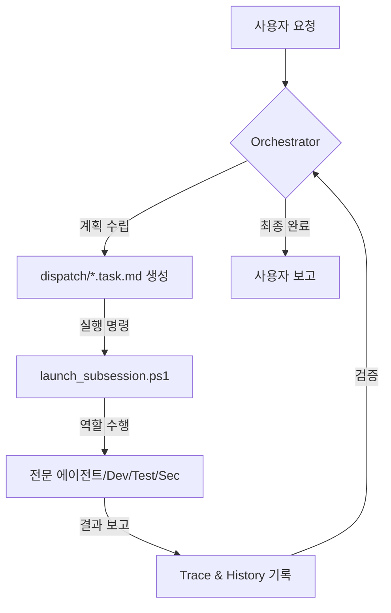

# giip FDE Agent 🤖📦

**당신의 PC에 설치되는 포워드 배포형(Forward-Deployed) AI 엔지니어링 팀**

> 🆕 **[What's New — 최근 업데이트](docs/WHATS_NEW.md)** · 일주일 이내 갱신 내용을 여기서 확인하세요.

[](README.md)
[](readme_jp.md)
[](readme_en.md)
[](readme_zh.md)

[](https://opensource.org/licenses/Apache-2.0)
[](https://en.wikipedia.org/wiki/Forward_Deployed_Engineer)
[](https://aistudio.google.com/app/apikey)
[](https://github.com/popup-studio-ai/bkit-claude-code)

---

## FDE Agent란? (What is the FDE Agent?)

**FDE(Forward Deployed Engineer)**는 원격에서 지원하는 대신 **고객의 현장에 직접 배치되어**
그 조직의 문제를 함께 풀어내는 엔지니어를 뜻합니다. Palantir가 만든 용어로, 요구사항 분석부터 설계·구현·통합·배포까지
고객 옆에서 전 주기를 책임지는 것이 특징입니다. ([Wikipedia](https://en.wikipedia.org/wiki/Forward_Deployed_Engineer))

**giip FDE Agent**는 이 개념을 AI 에이전트로 구현한 것입니다. 사람 대신 **AI 엔지니어링 팀이 여러분의 PC(=현장)에 상주**하며,
`.agent` 폴더 하나로 이식되어 스스로 계획하고(Plan) 구현하며(Do) 검증하고(Check) 자가 최적화하는(Act)
**"생각하는 에이전트 팀"**을 프로젝트에 즉시 투입합니다. 데이터와 컨텍스트는 로컬을 벗어나지 않습니다.

이 에이전트는 giip의 FDE 역량 — AI 기반 풀사이클 개발과 엔터프라이즈 운영 — 을 하나로 묶어 제공하는
[**giip FDE Box**](https://giip.littleworld.net/docs/plans/AI_FDE_Ops_Proposal_ko.html)의 실행 주체입니다.
인프라 운영부터 AI 네이티브 개발까지, 엔터프라이즈 운영 전 주기를 여러분의 로컬 환경에서 수행합니다.

> 💡 **설치·설정 지식이 전혀 없어도 괜찮습니다.** [**giip FDE Box**](https://giip.littleworld.net/docs/plans/AI_FDE_Ops_Proposal_ko.html)를
> 신청하기만 하면 전문가가 giip FDE Agent의 설치·연동을 대신 해드리고, 여러분은 곧바로 자유롭게 사용할 수 있습니다.

---

## 🚀 처음이신가요? (Gateway)

> [**빠른 시작 가이드**](QUICK_START.md)에서 5분 만에 첫 에이전트를 가동해 보세요!
>
> [도구 다운로드](TOOLS_DOWNLOAD.md) · [Antigravity 사용법](ANTIGRAVITY_USAGE_GUIDE.md) · [90분 온보딩](docs/00-onboarding/README.md) · [운영 거버넌스](docs/60-operations/README.md) · [Slack 봇 연결](QUICK_START.md#-slack-봇-연결하기-giipclaude-bot) · [유용한 링크](links.md)

---

## 💻 내 PC에 FDE Agent 설치하기 — Slack 봇부터 띄우기

`giip-fde-agent`는 **public 레포지토리**입니다. 따라서 이 레포 폴더 안에서 바로 작업하지 말고,
**레포를 받아 → 여러분이 작업 메인으로 쓸 폴더로 필요한 파일을 복사한 뒤 → 그 폴더를 워크스페이스로 삼아 Slack 봇을 띄우는** 것이
가장 빠르고 안전한 시작입니다. 이렇게 하면 업데이트를 받을 때 레포를 다시 pull 해도 여러분의 작업물과 섞이지 않습니다.

아래 순서대로 하면 **Slack에서 `@봇 <요청>`으로 FDE Agent에게 일을 시킬 수 있는 상태**까지 도달합니다.

### 사전 준비 (Prerequisites)

- **Node.js 18+** (`node -v`)
- **Claude CLI** 설치 및 로그인 — 봇은 Anthropic API Key 없이 `claude -p` CLI를 그대로 구동합니다.
  `claude --version`이 동작하고, 한 번 로그인(`claude` 실행 후 인증)돼 있어야 합니다. → [Claude Code](https://claude.ai/code)
- **Slack 워크스페이스 관리자 권한** (앱을 설치할 수 있어야 함)

---

### 1단계. 레포 받기 & 작업 메인 폴더로 복사

먼저 레포를 클론하고, **여러분이 작업 메인으로 쓸 폴더**(예: `C:\work\my-project`)를 만든 뒤 그 폴더로 에이전트 파일을 복사합니다(**`.git` 폴더 제외**).

#### Windows (PowerShell)
```powershell
# 1) 레포 클론 (임의 위치)
git clone https://github.com/LowyShin/giip-fde-agent.git

# 2) 작업 메인 폴더 생성 (경로는 원하는 대로)
New-Item -ItemType Directory -Force "C:\work\my-project"

# 3) 에이전트 + slack-bot 파일을 작업 폴더로 복사
cd giip-fde-agent
Copy-Item -Path ".agent", "GEMINI.md", ".cursorrules", "COPILOT_INSTRUCTIONS.md", "slack-bot" -Destination "C:\work\my-project" -Recurse -Force
```

#### Mac/Linux
```bash
# 1) 레포 클론
git clone https://github.com/LowyShin/giip-fde-agent.git

# 2) 작업 메인 폴더 생성
mkdir -p ~/work/my-project

# 3) 에이전트 + slack-bot 파일을 작업 폴더로 복사 (.git 제외)
cd giip-fde-agent
rsync -av --exclude='.git' .agent GEMINI.md .cursorrules COPILOT_INSTRUCTIONS.md slack-bot ~/work/my-project/
```

> 이후 모든 작업은 **복사한 작업 폴더**(`C:\work\my-project`)에서 진행합니다. 원본 `giip-fde-agent` 폴더는 업데이트 수신용으로만 두세요.

---

### 2단계. Slack 앱 만들기 (Socket Mode)

봇은 공개 URL이 필요 없는 **Socket Mode**로 동작합니다. [api.slack.com/apps](https://api.slack.com/apps)에서 앱을 만들고 아래 두 토큰을 발급받으세요.

1. **Create New App → From scratch** 로 앱 생성
2. **Socket Mode** 활성화 → App-Level Token 생성(스코프 `connections:write`) → `xapp-...` 복사
3. **OAuth & Permissions → Bot Token Scopes**: `chat:write`, `app_mentions:read`, `channels:history`, `channels:read`, `groups:history`, `im:history`, `im:read`, `im:write`, `users:read`
4. **Event Subscriptions** 활성화 → Subscribe to bot events: `app_mention`, `message.im`, `message.channels`, `message.groups`
5. **Install to Workspace** → 설치 후 **Bot User OAuth Token** `xoxb-...` 복사

> 상세한 스크린샷 수준 가이드는 [`slack-bot/SLACK_APP_SETUP.md`](slack-bot/SLACK_APP_SETUP.md)를 참고하세요.

---

### 3단계. slack-bot 설치 & `.env` 설정

작업 폴더 안의 `slack-bot`으로 들어가 의존성을 설치하고 `.env`를 채웁니다.

```powershell
cd C:\work\my-project\slack-bot
npm install
Copy-Item .env.example .env   # (Mac/Linux: cp .env.example .env)
```

`.env`에서 최소 3개 값을 채우면 됩니다.

```env
SLACK_BOT_TOKEN=xoxb-...                 # 2단계 5)에서 복사한 Bot Token
SLACK_APP_TOKEN=xapp-...                 # 2단계 2)에서 복사한 App-Level Token
WORKSPACE_DIR=C:\work\my-project         # 1단계에서 만든 작업 폴더 (.agent 가 있는 곳)

# 선택
# SLACK_CHANNEL_IDS=C0123456789          # 봇이 들을 채널 ID (미지정 시 DM은 항상 동작)
# BOT_NAME=My Team Bot
# GITHUB_TOKEN=ghp_...                    # !issues 명령용 GitHub PAT (repo scope)
# GITHUB_REPO=your-org/your-repo
```

> `WORKSPACE_DIR`은 **`.agent/`가 들어있는 작업 폴더**를 가리켜야 합니다. 봇은 이 폴더 기준으로 태스크를 처리하고 git push 합니다.

---

### 4단계. 봇 실행

```powershell
node index.js
```

`Socket Mode connected` 로그가 뜨면 성공입니다. 항상 켜두려면 **pm2**로 상시 구동을 권장합니다.

```powershell
npm install -g pm2
pm2 start index.js --name giipclaude-bot
pm2 save
pm2 logs giipclaude-bot     # 로그 확인
```

---

### 5단계. 채널에 초대하고 사용하기

봇을 사용할 채널에서 초대한 뒤 멘션하면 됩니다.

```
/invite @<봇 이름>

@<봇 이름> 설정 페이지에 다크모드 토글 추가해줘
→ 봇이 요청을 분석해 태스크 계획(ID 포함)을 올림

go 20240601120000
→ 서브에이전트가 실행 후 git push, 결과 GitHub URL을 회신
```

기타 명령: `tasklist`(대기 태스크), `cancel <taskID>`, `!issues`, DM으로 직접 대화 등.
전체 사용법은 [`slack-bot/README.md`](slack-bot/README.md)에 있습니다.

---

> [!TIP]
> Slack 봇 없이 **AI 도구(Antigravity, Cursor 등)로 직접** 쓰고 싶다면, 1단계 복사만으로 충분합니다.
> AI 도구에게 이렇게 명령해 보세요:
> **"넌 오케스트레이터야. 메인 지침서(GEMINI.md)를 읽고 현재 태스크를 분석해줘."**

> [!IMPORTANT]
> **Gemini API Key 설정** (이미지 생성 등 `.agent` 자동화 시 필요, 수동 작업 시 불필요):
> `.agent/settings.json.sample`을 `settings.json`으로 복사하고 발급받은 Gemini API Key를 입력하세요.
> (Slack 봇의 태스크 구동 자체는 Claude CLI를 쓰므로 이 키가 없어도 됩니다.)

---

## 🧠 어떻게 동작하는가 (How It Works)

FDE Agent는 **오케스트레이터(Orchestrator)**가 전체 전략을 세우고,
**서브 에이전트(Sub-Agents)**들이 각자의 전문 분야에서 작업을 실행하는 구조입니다.



에이전트를 구성하는 4대 요소(역할·규칙·스킬·워크플로우)의 상세는
👉 [**시스템 아키텍처 가이드**](docs/02-design/agent-components/overview.md)를 참고하세요.

---

## ✨ 왜 FDE Agent인가? (Key Strengths)

1. **Zero-Tool Setup**: 서드파티 툴 설치 없이, PowerShell과 기존 AI 개발 도구(Cursor, Antigravity 등)만으로 즉시 구동됩니다.
2. **Local-First / Forward-Deployed**: 에이전트가 현장(PC)에 상주하여 코드·인프라·문서 옆에서 직접 작업합니다.
3. **Korean-First Workflow**: 한국 개발 생태계에 최적화되어 한글 문서화와 상호작용성에서 독보적입니다.
4. **Advanced Engineering DNA**: Bkit(PDCA), Superpowers(TDD/Debugging), Gstack(보안/안전)의 정수를 통합했습니다.
5. **Native Optimization**: 리눅스·WSL2 없이 Windows 환경에서 실행 추적(Trace)과 자가 프롬프트 최적화(AI-Optimize)를 지원합니다.

### 👥 이런 분께 (Target Audience)
- **AI Native 개발자**: 페어 프로그래밍을 넘어 에이전트 팀을 관리하려는 분
- **스타트업 & MVP 팀**: 최소 인원으로 고품질 코드와 체계적 문서를 동시에 확보하려는 팀
- **레거시 관리자**: Systematic Debugging과 TDD로 안전하게 리팩토링하려는 분
- **자동화 매니아**: 반복 운영 업무를 신뢰할 수 있는 에이전트에게 위임하려는 분

---

## 🛠️ 지원되는 도구 (Supported Tools)

FDE Agent는 아래 최신 AI 개발 도구들과 완벽하게 호환됩니다.

| 도구 | 설명 | 상세 가이드 |
| :--- | :--- | :--- |
| **Antigravity** | Google Gemini 기반 전문가용 에이전트 플랫폼 | [보기](docs/04-tools/antigravity.md) |
| **Claude Code** | Anthropic의 CLI 기반 에이전틱 코딩 도구 | [보기](docs/04-tools/claude-code.md) |
| **Codex** | OpenAI의 에이전틱 코딩 플랫폼 (멀티 환경) | [보기](docs/04-tools/codex.md) |
| **Cursor** | 코드베이스 전체를 이해하는 AI 네이티브 에디터 | [보기](docs/04-tools/cursor.md) |
| **Gemini CLI** | 가장 빠르고 가벼운 터미널용 AI 유틸리티 | [보기](docs/04-tools/gemini-cli.md) |
| **Windsurf** | 흐름(Flow) 중심의 지능형 에이전틱 IDE | [보기](docs/04-tools/windsurf.md) |
| **VS Code** | Autopilot 자율 모드 지원 표준 에디터 | [보기](docs/04-tools/vscode.md) |
| **OpenClaw** | 에이전트를 메신저(Slack 등)와 연결하는 게이트웨이 | [보기](docs/04-tools/openclaw.md) |

---

## ⚙️ 운영 및 사용법 (Quick Guide)

| 작업 | 명령어 (PowerShell) | 설명 |
| :--- | :--- | :--- |
| **자동 실행** | `.\.agent\scripts\launch_subsession.ps1` | 대기 중인 태스크를 감지해 백그라운드 세션 시작 |
| **수동 핸드오프** | `.\.agent\scripts\launch_role.ps1` | 태스크 컨텍스트를 클립보드에 복사 (다른 채팅창 전달용) |
| **상태 확인** | `.\.agent\scripts\check_status.ps1` | 진행 중인 모든 태스크·프로세스 모니터링 |
| **자동 모니터링** | `.\auto_agent.bat` | 5분 간격으로 대기 작업을 체크해 자동 실행 |

---

## 🧩 핵심 역량 한눈에

FDE Agent에는 검증된 프레임워크의 정수가 통합되어 있습니다. 각 역량의 상세 원리·명령어는
👉 [**심화 역량 가이드 (CAPABILITIES.md)**](docs/CAPABILITIES.md)에서 확인하세요.

| # | 역량 | 요약 |
| :-: | :--- | :--- |
| 1 | **Bkit PDCA** | 설계·분석 후 구현하는 `/pdca` 사이클로 '만들면서 생각하는' 실수 방지 |
| 2 | **Superpowers** | 설계→구현→검증 파이프라인 + TDD·Systematic Debugging 내장 |
| 3 | **Gstack 안전/보안** | `/careful`·`/freeze` 가드레일, `/cso` STRIDE/OWASP 보안 감사 |
| 4 | **Native Trace/Optimize** | `/native-trace`로 추론 기록, `/aioptimize`로 프롬프트 자가 개선 |
| 5 | **K-Layer 지식 시스템** | 작업 이력에서 재사용 패턴을 `Claim`으로 추출·축적하는 자기강화 루프 |
| 6 | **design-md 디자인 탐색** | 4개 플랫폼 통합, 유명 브랜드 스타일 즉시 이식 |
| 7 | **OpenClaw 메신저 제어** | Slack·Discord·Telegram으로 원격 쿼리·작업 지시 |
| 8 | **Vibe Investing** | 외부 투자 레포를 5축 평가해 안전하게 통합 |
| 9 | **Agency 전문가 팀** | Workflow Architect 등 전문가 페르소나 + 프리미엄 UI/UX |
| 10 | **keep-codex-fast** | Codex 로컬 상태 점검·정리로 속도 저하 방지 |

> 코딩 전 행동 원칙(Think Before Coding / Simplicity First / Surgical Changes / Goal-Driven)은
> [Karpathy 가이드라인](.agent/rules/10_karpathy_guidelines.md)을 따릅니다.

---

## 🌐 GIIP Enterprise & Support

전문적인 서버 구축이나 AI 기반 인프라 관리가 필요하신가요?
- **giip FDE Box 제안서**: [한국어](https://giip.littleworld.net/docs/plans/AI_FDE_Ops_Proposal_ko.html) · [日本語](https://giip.littleworld.net/docs/plans/AI_FDE_Ops_Proposal_ja.html) · [English](https://giip.littleworld.net/docs/plans/AI_FDE_Ops_Proposal_en.html) · [中文](https://giip.littleworld.net/docs/plans/AI_FDE_Ops_Proposal_zh.html)
- **공식 홈페이지**: [giip.littleworld.net](https://giip.littleworld.net/)
- **문의 메일**: contact@littleworld.net

---

## 🙏 Special Thanks

이 시스템은 다음 프로젝트들의 영감을 받아 구축되었습니다:
- **[Superpowers](https://github.com/obra/superpowers)** (Engineering Rigor)
- **[Bkit](https://github.com/popup-studio-ai/bkit-claude-code)** (PDCA Methodology)
- **[Gstack](https://github.com/garrytan/gstack)** (Product Thinking & Safety)
- **[Agent Lightning](https://github.com/microsoft/agent-lightning)** (Tracing & APO)

> 참고 분석: [SkillOpt와 Agent Lightning의 GIIP Dev Agent 적용 비교 분석](docs/90-reports/msopt-lightning-giip-analysis.md)

---
© 2026 giip FDE Agent. Optimized for Antigravity & AI-Native Builders.
