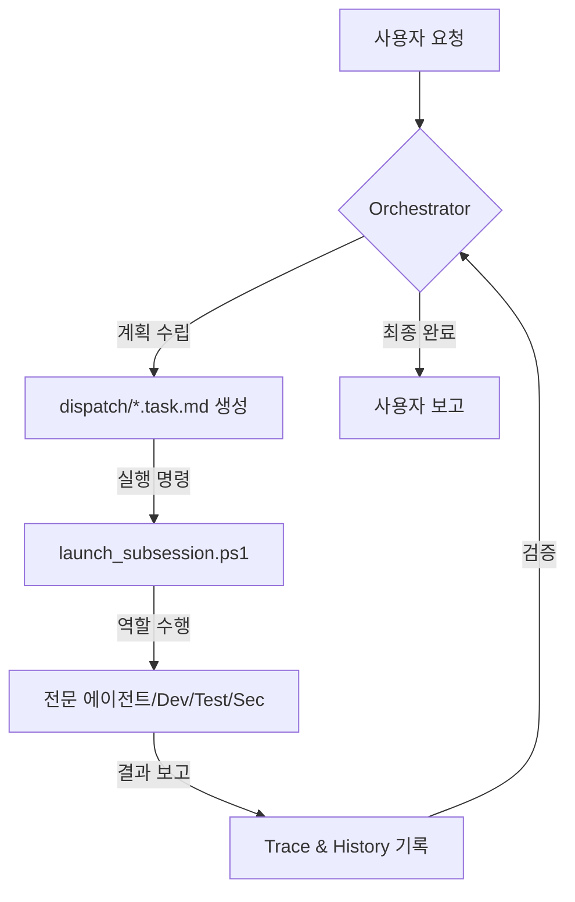

# GIIP Agent System: Autonomous Multi-Agent Framework 🤖

[English](readme_en.md) | [日本語](readme_jp.md)

[](https://opensource.org/licenses/Apache-2.0)
[](#-핵심-규칙)
[](https://aistudio.google.com/app/apikey)
[](https://github.com/popup-studio-ai/bkit-claude-code)

**GIIP Agent System**은 복잡한 소프트웨어 개발과 작업 자동화를 위해 설계된 **자율형 멀티 에이전트 프레임워크**입니다. 단순한 코딩 어시스턴트를 넘어, 스스로 계획하고(Plan), 검증하며(Check), 지속적으로 자가 최적화하는(AI-Optimize) "생각하는 개발팀"을 여러분의 프로젝트에 즉시 투입할 수 있습니다.

---

## 🎯 입문의 가교 (Gateway)

> **🚀 처음이신가요?**  
> [**빠른 시작 가이드**](QUICK_START.md)에서 5분 만에 첫 에이전트를 가동해 보세요!  
> [도구 다운로드](TOOLS_DOWNLOAD.md) | [Antigravity 사용법](ANTIGRAVITY_USAGE_GUIDE.md) | [유용한 링크](links.md)

---

## 🛠️ 지원되는 도구 (Supported Tools)

GIIP Agent System은 아래의 최신 AI 개발 도구들과 완벽하게 호환됩니다. 각 도구의 상세 가이드와 다운로드 정보는 링크를 참조하세요.

| 도구 | 설명 | 상세 가이드 |
| :--- | :--- | :--- |
| **Antigravity** | Google Gemini 기반의 전문가용 에이전트 플랫폼 | [상세 보기](docs/04-tools/antigravity.md) |
| **Claude Code** | Anthropic의 CLI 기반 에이전틱 코딩 도구 | [상세 보기](docs/04-tools/claude-code.md) |
| **Cursor** | 코드베이스 전체를 이해하는 AI 네이티브 에디터 | [상세 보기](docs/04-tools/cursor.md) |
| **Gemini CLI** | 가장 빠르고 가벼운 터미널용 AI 유틸리티 | [상세 보기](docs/04-tools/gemini-cli.md) |
| **Windsurf** | 흐름(Flow) 중심의 지능형 에이전틱 IDE | [상세 보기](docs/04-tools/windsurf.md) |
| **VS Code** | Autopilot 자율 모드를 지원하는 표준 에디터 | [상세 보기](docs/04-tools/vscode.md) |

---

## 👥 대상 사용자 (Target Audience)

- **AI Native 개발자**: AI와 함께 페어 프로그래밍을 넘어, 에이전트 팀을 관리하길 원하는 분.
- **스타트업 & MVP 팀**: 최소한의 인원으로 고품질의 코드와 체계적인 문서를 동시에 확보하려는 팀.
- **복잡한 레거시 관리자**: Systematic Debugging과 TDD를 통해 안전하게 코드를 리팩토링하려는 분.
- **자동화 매니아**: 반복적인 운영 업무를 신뢰할 수 있는 에이전트에게 위임하고 싶은 분.

---

## ✨ 왜 GIIP Agent System인가? (Key Strengths)

1.  **Zero-Tool Setup**: 추가적인 서드파티 툴 설치 없이, PowerShell과 기존 AI 개발 도구(Cursor, Antigravity 등)만으로 즉시 구동됩니다.
2.  **Korean-First Workflow**: 한국 개발 생태계에 최적화되어 한글 문서화와 상호작용성에서 독보적인 성능을 발휘합니다.
3.  **Advanced Engineering DNA**: Bkit(PDCA), Superpowers(TDD/Debugging), Gstack(보안/안전) 등 검증된 프레임워크들의 정수를 하나로 통합했습니다.
4.  **Native Optimization**: 리눅스나 WSL2 없이도 Windows 환경에서 완벽한 실행 추정(Trace) 및 자가 프롬프트 최적화(AI-Optimize)를 지원합니다.
5.  **Unobtrusive Transplant**: 기존 프로젝트 폴더에 `.agent` 폴더만 복사하면 즉시 에이전트 시스템이 활성화됩니다.

---

## 🚀 기존 프로젝트에 즉시 적용하기

여러분의 프로젝트 폴더로 이동하여 아래 명령어를 실행하면 GIIP Agent 시스템이 활성화됩니다 (**.git 폴더 제외**).

### Windows (PowerShell)
```powershell
# 필수 파일 복사 (giip-dev-agent 폴더 안에서 실행 또는 상대 경로 지정)
Copy-Item -Path ".agent", "GEMINI.md", ".cursorrules", "COPILOT_INSTRUCTIONS.md" -Destination "내_프로젝트_경로" -Recurse -Force
```

### Mac/Linux
```bash
# 필수 파일 복사 (rsync 사용 권장)
rsync -av --exclude='.git' .agent GEMINI.md .cursorrules COPILOT_INSTRUCTIONS.md 내_프로젝트_경로/
```

> [!TIP]
> 적용 후 AI 도구(Antigravity, Cursor 등)에게 **"넌 오케스트레이터야. GEMINI.md를 읽고 현재 태스크를 분석해줘."**라고 명령해 보세요.

---

## 🧠 핵심 개념 및 워크플로우

GIIP Agent System은 **오케스트레이터(Orchestrator)**가 전체 전략을 짜고, **서브 에이전트(Sub-Agents)**들이 각자의 전문 분야에서 작업을 실행하는 구조입니다.



---

## 🛠️ 강력한 에코시스템 통합 (Advanced Capabilities)

GIIP Agent System은 단순한 프롬프트 모음이 아닌, 세계 수준의 에이전트 기술들의 집약체입니다.

### 1. Bkit Vibecoding Kit (PDCA)
- **Plan-Design-Do-Check-Act**: 모든 기능을 구현하기 전 설계(Design)와 분석(Analyze) 단계를 거쳐 '만들면서 생각하는' 실수를 방지합니다.
- **`/pdca` 명령어**: 체계적인 리포팅과 갭 분석을 자동화합니다.

### 2. Superpowers Engineering
- **Subagent-Driven**: 하나의 작업을 `설계` -> `구현` -> `검증`의 파이프라인으로 분리.
- **Strong Skills**: TDD(Test Driven Development), Systematic Debugging, Brainstorming 스킬이 내장되어 있습니다.

### 3. Gstack (Safety & Security)
- **Founder Mode**: `/office-hours`, `/ceo-review`를 통해 제품의 본질과 UX를 다시 질문합니다.
- **Guardrails**: 파괴적 명령 전 경고(`/careful`) 및 작업 범위 제한(`/freeze`)으로 안전한 개발 환경을 제공합니다.
- **Security Audit**: `/cso` 명령어로 STRIDE/OWASP 기반의 보안 검사를 수행합니다.

### 4. Native Optimization & Tracing
- **`/native-trace`**: AI의 모든 추론 과정과 툴 호출 이력을 기록합니다.
- **`/aioptimize`**: 수집된 데이터를 바탕으로 에이전트가 스스로의 프롬프트를 수정하여 더 똑똑해집니다.

### 5. K-Layer Knowledge System (Karpathy Diagram)
- **Source-linked Knowledge**: 에이전트 작업 이력에서 재사용 가능한 패턴과 교훈을 `Claim` 단위로 자동으로 추출하고 축적합니다.
- **자기강화 루프**: 모든 지식은 원본 근거(Trace/Source)와 연결되어 있으며, 다음 작업 시 에이전트가 이를 참조하여 더 똑똑하게 행동합니다.
- [K-Layer 작동 원리](.agent/skills/k-layer/SKILL.md) | [지식 베이스](.agent/knowledge/README.md)

---

## ⚙️ 운영 및 사용법 (Quick Guide)

| 작업 | 명령어 (PowerShell) | 설명 |
| :--- | :--- | :--- |
| **자동 실행** | `.\.agent\scripts\launch_subsession.ps1` | 대기 중인 태스크를 감지하고 백그라운드 세션 시작 |
| **수동 핸드오프** | `.\.agent\scripts\launch_role.ps1` | 태스크 컨텍스트를 클립보드에 복사 (다른 채팅창에 전달용) |
| **상태 확인** | `.\.agent\scripts\check_status.ps1` | 현재 진행 중인 모든 태스크와 프로세스 모니터링 |
| **자동 모니터링** | `.\auto_agent.bat` | 5분 간격으로 대기 작업을 체크하여 자동 실행 |

> [!IMPORTANT]
> **API Key 설정 (자동화 시 필요. 수동으로 작업할 경우 필요 없음)**:  
> `.agent/settings.json.sample` 파일을 `settings.json`으로 복사하고 발급받은 Gemini API Key를 입력하세요.

---

## 🌐 GIIP Enterprise & Support

전문적인 서버 구축이나 AI 기반 인프라 관리가 필요하신가요?
- **공식 홈페이지**: [giip.littleworld.net](https://giip.littleworld.net/)
- **문의 메일**: contact@littleworld.net

---

## 🙏 Special Thanks

이 시스템은 다음 프로젝트들의 영감을 받아 구축되었습니다:
- **[Superpowers](https://github.com/obra/superpowers)** (Engineering Rigor)
- **[Bkit](https://github.com/popup-studio-ai/bkit-claude-code)** (PDCA Methodology)
- **[Gstack](https://github.com/garrytan/gstack)** (Product Thinking & Safety)
- **[Agent Lightning](https://github.com/microsoft/agent-lightning)** (Tracing & APO)

---
© 2026 GIIP Agent System. Optimized for Antigravity & AI-Native Builders.
