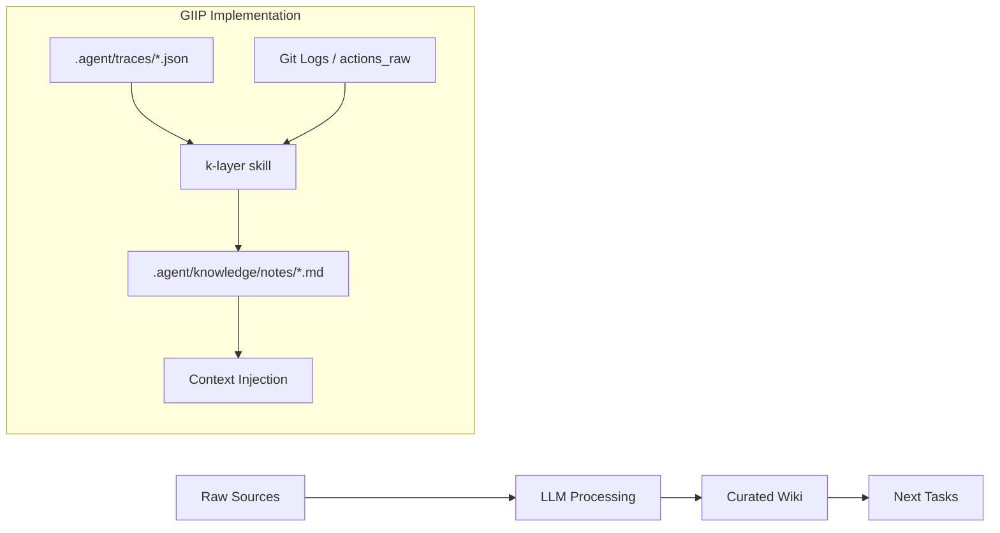

# Design: Karpathy K-Layer Knowledge System Integration

**Date**: 2026-04-15  
**Status**: Completed  
**Author**: GIIP Agent System

## 1. 개요 (Overview)
본 문서는 Andrej Karpathy가 제안한 "LLM Wiki" 패턴(카파시 다이어그램)을 GIIP 에이전트 프레임워크에 이식하기 위한 설계 사양을 정의합니다. 에이전트가 작업 수행 과정에서 얻은 지식을 스스로 기록하고, 다음 작업 시 이를 참조하여 성능을 지속적으로 향상시키는 "자기강화 루프(Self-Reinforcement Loop)" 구축을 목표로 합니다.

## 2. 시스템 아키텍처 (Architecture)

카파시 다이어그램의 4단계 흐름을 GIIP에 다음과 같이 매핑합니다.



### 2.1 Raw Sources (데이터 소스)
- **에이전트 실행 추적 (Traces)**: `/native-trace`를 통해 기록된 모든 툴 호출 및 추론 이력.
- **작업 이력 (History)**: `docs/HISTORY.md` 및 git 커밋 메시지.
- **실험 데이터**: 에이전트가 수행한 실험 결과물 (`actions_raw.jsonl` 등).

### 2.2 LLM Processing (지식 추출)
- **k-layer skill**: 작업 완료 후 결과를 분석하여 재사용 가능한 패턴, 오류 해결책, 도메인 지식을 추출합니다.
- **Evidence Discovery**: 단순히 요약하는 것이 아니라, 구체적인 수치나 파일 경로 등 "증거(evidence)"를 찾아냅니다.

### 2.3 Curated Wiki (K-Layer)
- **Source-linked Claims**: 모든 지식은 `CLAIM-NNN` 형식으로 기록되며, 반드시 원본 근거(`source`) 링크를 포함합니다.
- **Immutable/Append-only**: 한 번 기록된 지식은 삭제하지 않으며, 정보가 더 이상 유효하지 않을 경우 `invalidated_at` 필드에 날짜를 기록하여 무효화합니다.

### 2.4 Outputs (자기강화)
- **Context Injection**: 에이전트가 새로운 작업을 시작할 때, 관련 키워드로 K-Layer를 검색하여 관련 지식을 컨텍스트에 자동으로 포함시킵니다.

## 3. 지식 구조 (Data Structure)

지식 노트는 `.agent/knowledge/notes/` 폴더에 주제별로 저장됩니다.

### 3.1 Claim 형식 (Example)
```markdown
## [Topic Name]

CLAIM-001: {관찰된 사실 또는 패턴}
- **evidence**: {구체적 관측 데이터}
- **source**: {파일명#라인번호 또는 trace_id}
- **observed_at**: {YYYYMMDD}
- **invalidated_at**: null
- **confidence**: high|mid|low
```

## 4. 도입 효과 (Expected Impact)
- **반복 오류 감소**: 동일한 API 인증 오류나 환경 이슈를 두 번 겪지 않게 됩니다.
- **도메인 적응 가속화**: 에이전트가 프로젝트 특유의 명명 규칙이나 아키텍처 패턴을 빠르게 학습합니다.
- **신뢰성 확보**: 모든 에이전트의 주장에 근거가 연결되어 있어 검증이 용이합니다.

---
*관련 문서*: [Karpathy Diagram 분석 리포트](../70-LowyOpinion/capacydiagram.md)
