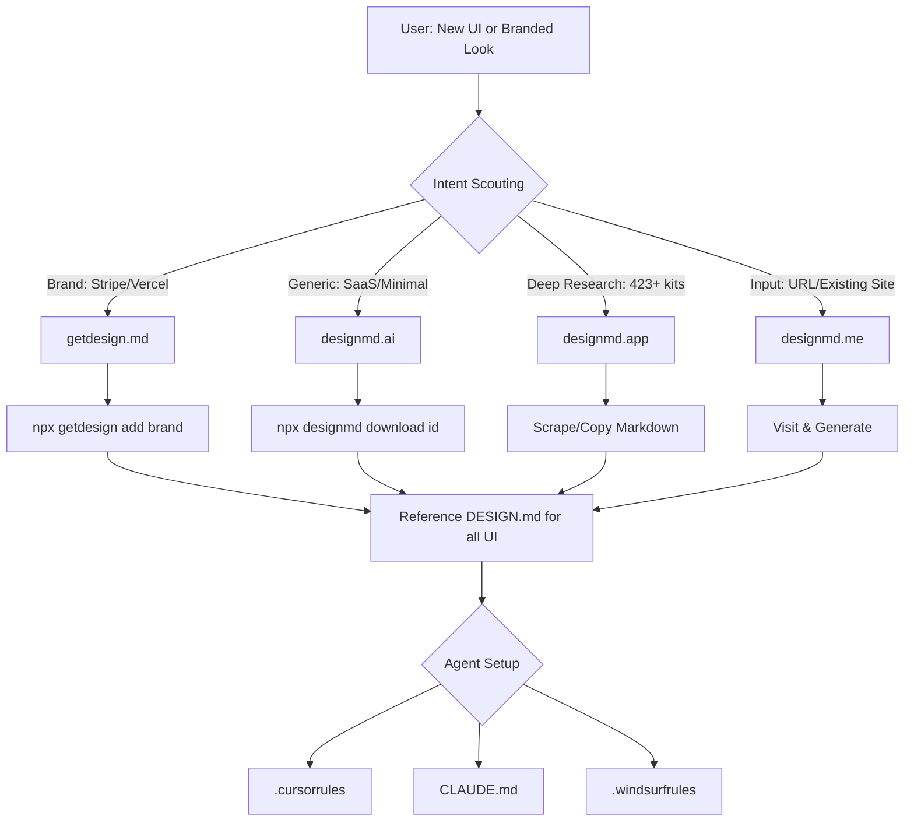

# Consolidated Design Discovery Interaction Flow

This document defines the interactive process for scouting and applying design systems across 4 key platforms.

## Overview
The flow branches based on the user's intent: automation, brand replication, or custom generation.

## Source Selection Matrix

| If User says... | Go to Source... | Action |
| :--- | :--- | :--- |
| "I want it to look like **Stripe**" | **getdesign.md** | `npx getdesign add stripe` |
| "Find me a **trending SaaS** kit" | **designmd.ai** | `npx designmd search "saas" --sort trending` |
| "Show me **everything** for dashboards" | **designmd.app** | Browse the 423+ collection via `llms.txt` |
| "Make it look like **this site** [URL]" | **designmd.me** | Navigate to [designmd.me](https://designmd.me) and extract |

## Agent Integration Rules
After a design is selected and applied as `DESIGN.md`:
1.  **Check Context**: Identify which AI agent is currently active (Cursor, Claude Code, etc.).
2.  **Pull Guide**: Check [designmd.app/guides](https://designmd.app/en/guides) for the specific agent rule format.
3.  **Generate Rules**: Create the `.cursorrules`, `CLAUDE.md`, or relevant file to enforce the design tokens at the agent's core steering layer.

## Setup Guidance Flow
1.  **Selection**: User chooses a kit (e.g., "InsightDeck").
2.  **Verification**: Agent checks for API Key requirements.
3.  **Communication**: Agent provides link for API Key or direct download command.
4.  **Completion**: Design metadata and tokens are logged into the project's knowledge base.
