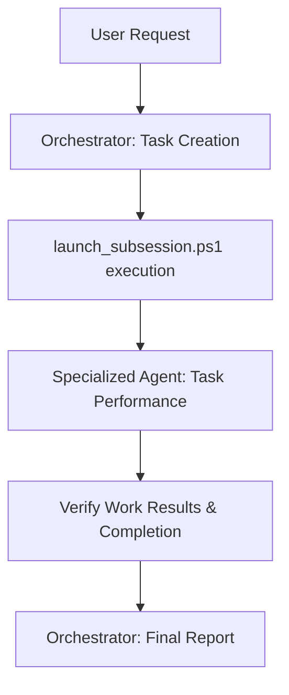

# GIIP Agent System: Autonomous Multi-Agent Framework 🤖

[한국어](README.md) | [日本語](readme_jp.md)

[](https://opensource.org/licenses/Apache-2.0)
[](http://makeapullrequest.com)
[](#-core-principles)
[](https://aistudio.google.com/app/apikey)

> **🚀 New to AI development tools?**  
> Check out the [**Quick Start Guide**](QUICK_START_EN.md) for friendly step-by-step instructions!  
> [AI Tools Download Links](TOOLS_DOWNLOAD.md) | [Antigravity Usage Guide](ANTIGRAVITY_USAGE_GUIDE.md)

**GIIP Agent System** is an agent created by independently extracting only the **Autonomous Multi-Agent Framework** designed for complex software development and task automation.

You can build your own agent system by modifying the contents of the roles according to your know-how and purpose.

Basically, it provides a state-of-the-art AI workflow where the Orchestrator and specialized sub-agents collaborate utilizing the Google Gemini API.
If you don't use the Google Gemini API, you can use it manually at a low cost. And if you want to use another API, just instruct the orchestrator, and it will change it to suit your environment.

This framework adopts the concept of **Role-based Sub-Agents** similar to **Claude Code's skills** or **OpenCode**, elaborately dividing and solving complex tasks.

Specifically designed and optimized for the **Antigravity Tool**, it runs immediately with existing development tools and PowerShell environments without installing separate third-party tools. It provides excellent stability and compatibility even in Electron-based terminal environments.

It is optimized for the Korean Developer Ecosystem, and all processes and documentation follow the **Korean-First** principle.


## ✨ Key Features

- **Multi-Agent Collaboration**: Role-based collaboration in the style of Claude Code/OpenCode.
- **Superpowers Native**: Built-in advanced engineering skills such as Plan, TDD, and Systematic Debugging.
- **Multi-Platform Ready**: Immediately compatible with various AI tools such as Cursor, GitHub Copilot, and Claude.
- **Autonomous Development**: Autonomous task performance from requirement analysis to implementation and verification.
- **Antigravity Optimized**: Perfect sync and optimized workflow with the Antigravity tool.
- **Zero-Tool Setup**: Immediately usable in the existing PowerShell environment without additional tool installation.
- **Environment Stability**: Works perfectly in an Electron-based PowerShell environment.
- **Gemini API Native**: High-performance reasoning and code generation utilizing the latest Google Gemini model.
- **Korean-First Workflow**: Optimized for Korean-based documentation and agent interaction.
- **React Best Practices**: Optimized Frontend code generation by applying Vercel's React Best Practices Rules.
- **Bkit Vibecoding Kit**: Provides systematic development and Bkit feature usage reporting based on PDCA methodology.

This repository is a space for managing the settings, role definitions, and workflows of the GIIP AI Agent system.

Since only the definitions of the roles for sub-agents actually used or necessary functions are collected in the `.agent` folder, overwriting the contents of this repository onto an existing project will not affect the existing project.

After copying the files and directories of this repository to the folder you are working in, start antigravity. Then, the preparation is finished by entering the chat as follows.

```
You are the orchestrator. Check your role, analyze the tasks below, and delegate the work to each person in charge.
If there is no appropriate role to delegate, create a new role and delegate it to the person in charge.

-- Task Details --

```

Now you will be able to give work instructions in the current chat screen.

## 🤝 Compatibility

This project supports various AI agent environments:
- **Antigravity**: `GEMINI.md` automatic recognition
- **Cursor / Windsurf**: `.cursorrules` automatic recognition
- **GitHub Copilot**: `COPILOT_INSTRUCTIONS.md` automatic recognition
- **Claude / OpenCode**: Easy setup through `SETUP_AGENTS.md` guide

## 🛠️ Prerequisites

To use this system, the following tools must be installed:

1. **PowerShell 7+**: [Installation Guide](https://learn.microsoft.com/en-us/powershell/scripting/install/installing-powershell-on-windows)
2. **Node.js**: LTS version is recommended from the [official site](https://nodejs.org/).
3. **Gemini CLI**: Run the following command in the terminal to install globally.
   ```powershell
   npm install -g @google/gemini-cli
   ```

## ⚙️ Setup & Configuration

### 1. API Key Setting
Setting an API Key is necessary to use the Gemini API.
(Not required if using manual start only.)

First, if you ask the antigravity tool to analyze the agent script and create a setting.json sample file, the file will be created.

1. Get an API Key from [Google AI Studio](https://aistudio.google.com/app/apikey).
2. Copy the `.agent/settings.json.sample` file in the project root to `settings.json` in the same folder.
3. Open the copied `settings.json` file and replace the `"YOUR_GEMINI_API_KEY_HERE"` part with the actual key issued.

> [!NOTE]
> The `launch_subsession.ps1` script first checks `.agent/settings.json` within the project, and if it doesn't exist, it refers to the user's home directory (`~/.gemini/settings.json`).

## 📁 Directory Structure

```text
.agent/
├── roles/          # Persona and responsibility definitions for each agent (Developer, Tester, etc.)
├── dispatch/       # Task definition files (TASK_YYYYMMDD-ID.md)
├── scripts/        # [PowerShell script tools for system operation](./.agent/scripts/README.md)
├── work_history/   # Record of work history (Rule compliance)
└── README.md       # System detailed guide
```

## 🚀 Basic Usage

There are two ways to start a sub-agent session in the background after giving a command. You must execute one of the two for the sub-agents of each role to start work.

### 1. Automatic Start (when using gemini-cli)
Automatically detects pending tasks and starts a `gemini-cli` session with the appropriate role immediately.
```powershell
.\.agent\scripts\launch_subsession.ps1
```

- Periodic automatic execution (using batch file)
You can set the agent to automatically check every 5 minutes and perform tasks.
```cmd
.\auto_agent.bat
```
This script maintains the running window and repeatedly calls `launch_subsession.ps1` at 5-minute (300-second) intervals.

### 2. Manual Start (Clipboard Handoff)
Used when you want to paste work into a new session in an environment such as Agent Manager without `gemini-cli`. It finds pending tasks and copies the context of the relevant role to the clipboard.
```powershell
.\.agent\scripts\launch_role.ps1
```
After execution, start the work by pasting it with `Ctrl+V` in the window chatting with the agent. (Creating a new conversation (plus button on the left) in the agent manager and pasting it is the most certain way.)

## 📊 Monitoring & Status
Check the progress of all tasks and currently running background processes.
```powershell
.\.agent\scripts\check_status.ps1
```

### 3. Check Work History
All work history of the agents is recorded by date in the `work_history` directory.

## 🚨 Core Principles
All agents strictly adhere to the following rules:
1.  **Evidence First**: Technical basis is always presented by linking as a markdown file.
2.  **Korean First**: In principle, all outputs and documents are written in Korean. (Note: This README is an English version for global compatibility).
3.  **Clean Code**: Write code that is highly readable and easy to maintain, and eliminate unnecessary duplication.

## 🔄 Agent Workflow



1.  The **Orchestrator** analyzes the request and creates a task in the `dispatch` directory.
2.  The user or system executes `launch_subsession.ps1`.
3.  The **Sub-Agent** (e.g., Developer, Tester) performs the work and updates the status to `Completed`.
4.  The **Orchestrator** verifies the final output.

## 📦 Bkit Vibecoding Kit Integration

**Bkit** is a Vibecoding Kit that combines the PDCA (Plan-Design-Do-Check-Act) methodology with an agent workflow to maximize development efficiency and quality.

- **PDCA Loop**: Systematic development process management through commands such as `/pdca plan`, `/pdca design`, and `/pdca analyze`.
- **Gap Analysis**: Automatically analyzes the difference between implementation and design to ensure quality.
- **Automated Reporting**: Provides standardized reporting on all work results.

See [.gemini/README.md](.gemini/README.md) or [GEMINI.md](GEMINI.md) for detailed usage.

## 📚 Additional Documentation & Guides

- **[Antigravity Usage Guide](ANTIGRAVITY_USAGE_GUIDE.md)**: Detailed explanation of how to effectively utilize Antigravity skills and Bkit methodology. Covers advanced development patterns such as PDCA cycle, systematic debugging, and TDD.
- **[Prompt Examples](prompt_example.md)**: Provides various prompt examples for efficient agent utilization. Includes development phase-specific and platform-specific skill usage, as well as how to write complex prompts.
- **[Useful Agent Links](links.md)**: A collection of external resources and tools to help with agent development and operation.

> [!TIP]

> **Easy Translation**: If you prefer to read these documents in your native language, simply ask an AI assistant (like ChatGPT, Claude, or Gemini) to translate the content for you. For example: "Please translate this document to [your language]." This makes it easy to access the content in any language you're comfortable with.

## 🦸 Superpowers Integration

This framework embeds the [Superpowers](https://github.com/obra/superpowers) system to make the agent act like a **responsible engineer** rather than a simple coding machine.

- **Subagent Driven Development**: Processes one complex task through a 3-step pipeline: `Implementation` -> `Spec Review` -> `Code Quality Review`.
- **Writing Plans**: Validates the design by writing `implementation_plan.md` before touching the code.
- **Test Driven Development (TDD)**: Writes defect-free code through the `Red` -> `Green` -> `Refactor` cycle.
- **Systematic Debugging**: Resolves the root cause with hypothesis-verification debugging rather than random modifications.

## 🛡️ Gstack Integration

Powerful specialized skills from [Gstack (garrytan/gstack)](https://github.com/garrytan/gstack) have been integrated to significantly enhance the agent's thinking capabilities and safety.

- **Office Hours & CEO Review**: Rethink the essence of the product before implementation (Founder Mode), and review plans with a focus on user experience. (`/office-hours`, `/ceo-review`)
- **Staff Engineer Audit**: In-depth code reviews at a senior engineer level, including N+1 queries, race conditions, and data trust boundaries. (Enhanced `/code-review`)
- **Security CSO**: Threat modeling and independent vulnerability analysis based on STRIDE and OWASP. (`/cso`)
- **Safety Guardrails**: Warnings before executing destructive commands (`/careful`) and restricting the work scope to specific folders (`/freeze`) to prevent accidents.

## 🌐 GIIP Enterprise Managed Service

Do you need more powerful and stable system operation? **GIIP** provides a collaboration model between experts and AI for automatic infrastructure management and security threat detection.

- **Infrastructure Automation**: AI performs repetitive operational tasks instead.
- **Security Threat Detection**: Detects threats in real-time and responds quickly.
- **Expert Collaboration**: Combines AI efficiency with expert judgment to ensure the best quality.

Leave complex management to experts and focus on the essence of your business.

👉 [Visit GIIP Official Website](https://giip.littleworld.net/) or contact contact@littleworld.net for assistance. (Support for server/infrastructure setup available)

## 🙏 Special Thanks

Thanks to those who helped with this project:

- [Roy Koo](https://www.linkedin.com/in/roykoo99/)
  - Idea for multi api key
- [Old Man Carving Code (코드깎는노인)](https://www.youtube.com/@%EC%BD%94%EB%93%9C%EA%B9%8E%EB%8A%94%EB%85%B8%EC%9D%B8)
  - Inspection logic for react
- [superpowers](https://github.com/obra/superpowers)
  - Strengthening development verification logic

- [Bkit Vibecoding Kit](https://github.com/popup-studio-ai/bkit-claude-code) (Licensed under Apache 2.0)
  - Development optimization based on PDCA methodology
- [gstack](https://github.com/garrytan/gstack)
  - Integration of product-focused thinking, safety guardrails, and security audit logic
