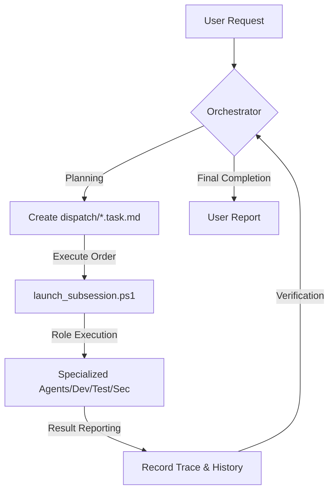

# giip FDE Agent 🤖📦

**A Forward-Deployed AI engineering team that installs onto your PC**

[한국어](README.md) | [日本語](readme_jp.md)

> [!TIP]
> If you have downloaded this repository and find that documentation in your language is missing (only Korean is available), please ask your AI assistant (Antigravity, Cursor, etc.) to translate it for you.

[](https://opensource.org/licenses/Apache-2.0)
[](#-capabilities-at-a-glance)
[](https://aistudio.google.com/app/apikey)
[](https://github.com/popup-studio-ai/bkit-claude-code)

---

## What is the FDE Agent?

A **Forward Deployed Engineer (FDE)** is an engineer who, instead of supporting from afar, is **embedded directly at the customer's site** to solve that organization's problems alongside them. Coined by Palantir, the role owns the full lifecycle — requirements analysis, design, implementation, integration, and deployment — right next to the customer. ([Wikipedia](https://en.wikipedia.org/wiki/Forward_Deployed_Engineer))

**giip FDE Agent** brings this concept to life as an AI agent. Instead of people, an **AI engineering team lives on your PC (the "site")** — transplanted via a single `.agent` folder — and instantly deploys a **"thinking agent team"** that plans (Plan), implements (Do), verifies (Check), and self-optimizes (Act). Your data and context never leave your local machine.

This agent is the executor of the [**giip FDE Box**](https://giip.littleworld.net/docs/plans/AIFDEOpsProposalen.html), which packages giip's FDE capability — AI-driven full-cycle development and enterprise operations — into one box. From infrastructure ops to AI-native development, it runs the entire enterprise-ops lifecycle in your local environment.

---

## 🚀 First time here? (Gateway)

> Check out the [**Quick Start Guide**](QUICK_START_EN.md) to launch your first agent in 5 minutes!
>
> [Tools Download](TOOLS_DOWNLOAD.md) · [Antigravity Usage](ANTIGRAVITY_USAGE_GUIDE.md) · [90-min Onboarding](docs/00-onboarding/README.md) · [Operations Governance](docs/60-operations/README.md) · [Useful Links](links.md)

---

## 💻 Install the FDE Agent onto your PC

Move to your project folder and transplant the agent files (**excluding the `.git` folder**) to instantly activate the FDE Agent.

### Windows (PowerShell)
```powershell
# Copy essential files (run inside the giip-fde-agent folder or specify a relative path)
Copy-Item -Path ".agent", "GEMINI.md", ".cursorrules", "COPILOT_INSTRUCTIONS.md" -Destination "YOUR_PROJECT_PATH" -Recurse -Force
```

### Mac/Linux
```bash
# Copy essential files (rsync recommended)
rsync -av --exclude='.git' .agent GEMINI.md .cursorrules COPILOT_INSTRUCTIONS.md YOUR_PROJECT_PATH/
```

> [!TIP]
> After installation, tell your AI tool (Antigravity, Cursor, etc.):
> **"You are the Orchestrator. Read GEMINI.md and analyze the current task."**

> [!IMPORTANT]
> **API Key Setup** (required for automation, not needed for manual work):
> Copy `.agent/settings.json.sample` to `settings.json` and enter your issued Gemini API Key.

---

## 🧠 How It Works

The FDE Agent works with an **Orchestrator** setting the overall strategy and **Sub-Agents** executing tasks in their specialized fields.



For details on the four core components (Roles, Rules, Skills, Workflows),
👉 see the [**System Architecture Guide**](docs/02-design/agent-components/overview.md).

---

## ✨ Why the FDE Agent? (Key Strengths)

1. **Zero-Tool Setup**: Works out-of-the-box with PowerShell and existing AI development tools (Cursor, Antigravity, etc.) — no extra third-party installs.
2. **Local-First / Forward-Deployed**: The agent lives on-site (your PC) and works right next to your code, infrastructure, and docs.
3. **Korean-First Workflow**: Optimized for the Korean development ecosystem, with peerless Korean documentation and interaction.
4. **Advanced Engineering DNA**: Integrates the essence of Bkit (PDCA), Superpowers (TDD/Debugging), and Gstack (Security/Safety).
5. **Native Optimization**: Supports full Execution Tracing and Self-Prompt Optimization (AI-Optimize) natively on Windows — no Linux or WSL2 required.

### 👥 Target Audience
- **AI-Native Developers**: Those who want to move beyond pair programming and manage an entire agent team.
- **Startups & MVP Teams**: Teams securing high-quality code and systematic documentation with minimal headcount.
- **Complex Legacy Managers**: Those refactoring safely with Systematic Debugging and TDD.
- **Automation Enthusiasts**: Those delegating repetitive operational tasks to reliable agents.

---

## 🛠️ Supported Tools

The FDE Agent is perfectly compatible with the following state-of-the-art AI development tools.

| Tool | Description | Detailed Guide |
| :--- | :--- | :--- |
| **Antigravity** | Professional agent platform based on Google Gemini | [Details](docs/04-tools/antigravity.md) |
| **Claude Code** | Anthropic's CLI-based agentic coding tool | [Details](docs/04-tools/claude-code.md) |
| **Codex** | OpenAI's agentic coding platform (multi-environment) | [Details](docs/04-tools/codex.md) |
| **Cursor** | AI-native editor with full codebase understanding | [Details](docs/04-tools/cursor.md) |
| **Gemini CLI** | Fastest and lightest terminal AI utility | [Details](docs/04-tools/gemini-cli.md) |
| **Windsurf** | Flow-centric intelligent agentic IDE | [Details](docs/04-tools/windsurf.md) |
| **VS Code** | Standard editor supporting Autopilot autonomous mode | [Details](docs/04-tools/vscode.md) |
| **OpenClaw** | Gateway connecting agents to messengers (Slack, etc.) | [Details](docs/04-tools/openclaw_en.md) |

---

## ⚙️ Operations & Usage (Quick Guide)

| Task | Command (PowerShell) | Description |
| :--- | :--- | :--- |
| **Auto Launch** | `.\.agent\scripts\launch_subsession.ps1` | Detects pending tasks and starts background sessions |
| **Manual Handoff** | `.\.agent\scripts\launch_role.ps1` | Copies task context to clipboard (for other chat windows) |
| **Check Status** | `.\.agent\scripts\check_status.ps1` | Monitors all ongoing tasks and background processes |
| **Auto Monitoring** | `.\auto_agent.bat` | Checks pending tasks every 5 mins for auto-execution |

---

## 🧩 Capabilities at a Glance

The FDE Agent consolidates the essence of proven frameworks. For each capability's detailed principles and commands,
👉 see the [**Advanced Capabilities Guide (CAPABILITIES_en.md)**](docs/CAPABILITIES_en.md).

| # | Capability | Summary |
| :-: | :--- | :--- |
| 1 | **Bkit PDCA** | The `/pdca` cycle designs & analyzes before building, preventing 'think-while-making' mistakes |
| 2 | **Superpowers** | Design→Implement→Verify pipeline + built-in TDD & Systematic Debugging |
| 3 | **Gstack Safety/Security** | `/careful` & `/freeze` guardrails, `/cso` STRIDE/OWASP security audits |
| 4 | **Native Trace/Optimize** | `/native-trace` records reasoning, `/aioptimize` self-improves prompts |
| 5 | **K-Layer Knowledge** | Extracts reusable patterns as `Claim` units — a self-reinforcing loop |
| 6 | **design-md Discovery** | Integrates 4 platforms, instantly transplants famous brand styles |
| 7 | **OpenClaw Messenger** | Remote query & task orders via Slack/Discord/Telegram |
| 8 | **Vibe Investing** | Safely grafts external investing repos after a 5-axis evaluation |
| 9 | **Agency Expert Team** | Expert personas like Workflow Architect + premium UI/UX |
| 10 | **keep-codex-fast** | Inspects & cleans Codex local state to prevent slowdowns |

> Pre-coding behavioral principles (Think Before Coding / Simplicity First / Surgical Changes / Goal-Driven)
> follow the [Karpathy Guidelines](.agent/rules/10_karpathy_guidelines.md).

---

## 🌐 GIIP Enterprise & Support

Need professional server setup or AI-based infrastructure management?
- **giip FDE Box proposal**: [한국어](https://giip.littleworld.net/docs/plans/AIFDEOpsProposalko.html) · [日本語](https://giip.littleworld.net/docs/plans/AIFDEOpsProposalja.html) · [English](https://giip.littleworld.net/docs/plans/AIFDEOpsProposalen.html)
- **Official Website**: [giip.littleworld.net](https://giip.littleworld.net/)
- **Contact Email**: contact@littleworld.net

---

## 🙏 Special Thanks

This system was built with inspiration from the following projects:
- **[Superpowers](https://github.com/obra/superpowers)** (Engineering Rigor)
- **[Bkit](https://github.com/popup-studio-ai/bkit-claude-code)** (PDCA Methodology)
- **[Gstack](https://github.com/garrytan/gstack)** (Product Thinking & Safety)
- **[Agent Lightning](https://github.com/microsoft/agent-lightning)** (Tracing & APO)

---
© 2026 giip FDE Agent. Optimized for Antigravity & AI-Native Builders.
