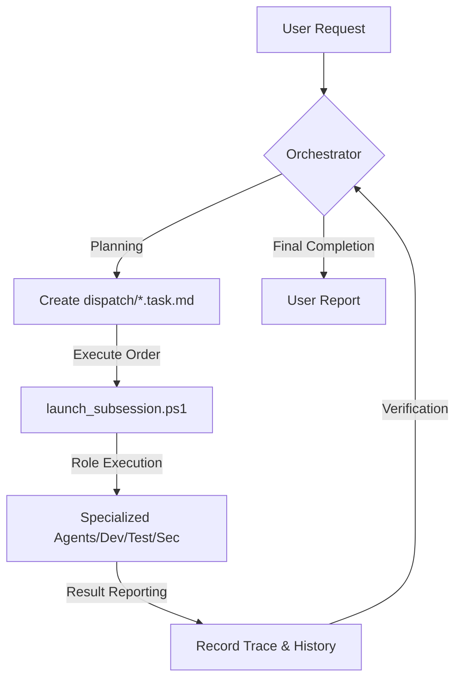

# GIIP Agent System: Autonomous Multi-Agent Framework 🤖

[한국어](README.md) | [日本語](readme_jp.md)

[](https://opensource.org/licenses/Apache-2.0)
[](#-핵심-규칙)
[](https://aistudio.google.com/app/apikey)
[](https://github.com/popup-studio-ai/bkit-claude-code)

**GIIP Agent System** is an **Autonomous Multi-Agent Framework** designed for complex software development and task automation. Beyond simple coding assistants, it brings a "thinking development team" that plans, verifies (Check), and continuously self-optimizes (AI-Optimize) into your project instantly.

---

## 🎯 Gateway to Onboarding

> **🚀 First time here?**  
> Check out the [**Quick Start Guide**](QUICK_START.md) to launch your first agent in 5 minutes!  
> [Tools Download](TOOLS_DOWNLOAD.md) | [Antigravity Usage](ANTIGRAVITY_USAGE_GUIDE.md) | [Useful Links](links.md)

---

## 🛠️ Supported Tools

GIIP Agent System is perfectly compatible with the following state-of-the-art AI development tools. Refer to the links for detailed guides and downloads.

| Tool | Description | Detailed Guide |
| :--- | :--- | :--- |
| **Antigravity** | Professional agent platform based on Google Gemini | [Details](docs/04-tools/antigravity.md) |
| **Claude Code** | Anthropic's CLI-based agentic coding tool | [Details](docs/04-tools/claude-code.md) |
| **Cursor** | AI-native editor with full codebase understanding | [Details](docs/04-tools/cursor.md) |
| **Gemini CLI** | Fastest and lightest terminal AI utility | [Details](docs/04-tools/gemini-cli.md) |
| **Windsurf** | Flow-centric intelligent agentic IDE | [Details](docs/04-tools/windsurf.md) |
| **VS Code** | Standard editor supporting Autopilot autonomous mode | [Details](docs/04-tools/vscode.md) |
| **OpenClaw** | Gateway connecting agents to messengers (Slack, etc.) | [Details](docs/04-tools/openclaw_en.md) |

---

## 👥 Target Audience

- **AI-Native Developers**: Those who want to move beyond pair programming and manage an entire agent team.
- **Startups & MVP Teams**: Teams looking to secure high-quality code and systematic documentation with minimal headcount.
- **Complex Legacy Managers**: Those who want to safely refactor code using Systematic Debugging and TDD.
- **Automation Enthusiasts**: Those who want to delegate repetitive operational tasks to reliable agents.

---

## ✨ Why GIIP Agent System? (Key Strengths)

1.  **Zero-Tool Setup**: Works out-of-the-box with PowerShell and existing AI development tools (Cursor, Antigravity, etc.) without extra third-party tool installations.
2.  **Korean-First Workflow**: Optimized for the Korean development ecosystem, showing peerless performance in Korean documentation and interaction.
3.  **Advanced Engineering DNA**: Integrates the essence of proven frameworks like Bkit (PDCA), Superpowers (TDD/Debugging), and Gstack (Security/Safety).
4.  **Native Optimization**: Supports full Execution Tracing and Self-Prompt Optimization (AI-Optimize) natively on Windows without Linux or WSL2.
5.  **Unobtrusive Transplant**: Simply copy the `.agent` folder to your project to instantly activate the agent system.

---

## 🚀 Instant Integration to Existing Projects

Move to your project folder and run the following command to activate the GIIP Agent system (**Excluding .git folder**).

### Windows (PowerShell)
```powershell
# Copy essential files (Run inside giip-dev-agent folder or specify relative path)
Copy-Item -Path ".agent", "GEMINI.md", ".cursorrules", "COPILOT_INSTRUCTIONS.md" -Destination "YOUR_PROJECT_PATH" -Recurse -Force
```

### Mac/Linux
```bash
# Copy essential files (rsync recommended)
rsync -av --exclude='.git' .agent GEMINI.md .cursorrules COPILOT_INSTRUCTIONS.md YOUR_PROJECT_PATH/
```

> [!TIP]
> After application, tell your AI tool (Antigravity, Cursor, etc.): **"You are the Orchestrator. Read GEMINI.md and analyze the current task."**

---

## 🧠 Core Concepts & Workflow

GIIP Agent System works with an **Orchestrator** setting the overall strategy and **Sub-Agents** executing tasks in their specialized fields.



---

## 📂 Agent System Components (System Architecture)

Detailed guides for the four core components that make up the GIIP Agent framework.

- [**Components Overview**](docs/02-design/agent-components/overview.md)
- [**Roles**](docs/02-design/agent-components/role.md): Define persona and scope of responsibility
- [**Rules**](docs/02-design/agent-components/rule.md): Enforced guidelines and quality control
- [**Skills**](docs/02-design/agent-components/skill.md): Specialized knowledge and tool packages
- [**Workflows**](docs/02-design/agent-components/workflow.md): Complex procedures and custom commands

---

## 🛠️ Advanced Ecosystem Integration

GIIP Agent System is more than just a collection of prompts; it's a consolidation of world-class agent technologies.

### 1. Bkit Vibecoding Kit (PDCA)
- **Plan-Design-Do-Check-Act**: Ensures a 'thinking before making' process through Design and Analysis phases before implementation.
- **`/pdca` Commands**: Automates systematic reporting and gap analysis.

### 2. Superpowers Engineering
- **Subagent-Driven**: Decouples a single task into a pipeline of `Design` -> `Implementation` -> `Verification`.
- **Strong Skills**: Built-in TDD (Test Driven Development), Systematic Debugging, and Brainstorming skills.

### 3. Gstack (Safety & Security)
- **Founder Mode**: Challenges the essence of the product and UX via `/office-hours` and `/ceo-review`.
- **Guardrails**: Provides a safe development environment with warnings before destructive commands (`/careful`) and scope locking (`/freeze`).
- **Security Audit**: Performs STRIDE/OWASP-based security checks with the `/cso` command.

### 4. Native Optimization & Tracing
- **`/native-trace`**: Records all reasoning steps and tool invocation histories of the AI.
- **`/aioptimize`**: The agent automatically refines its own prompts based on collected data to become smarter.

### 5. K-Layer Knowledge System (Karpathy Diagram)
- **Source-linked Knowledge**: Automatically extracts and accumulates reusable patterns and lessons from agent history as `Claim` units.
- **Self-Reinforcement Loop**: Every piece of knowledge is linked to its original evidence (Trace/Source), allowing agents to act smarter in subsequent tasks by referring to it.
- [K-Layer Principles](.agent/skills/k-layer/SKILL.md) | [Knowledge Base](.agent/knowledge/README.md)

### 5-1. Andrej Karpathy Behavioral Guidelines
- **Think Before Coding**: State assumptions explicitly before implementing. Ask when uncertain. Present multiple interpretations instead of picking silently.
- **Simplicity First**: Write the minimum code that solves the problem. No speculative features, abstractions, or unrequested flexibility.
- **Surgical Changes**: Touch only what you must. Don't improve unrelated code, comments, or formatting.
- **Goal-Driven Execution**: Define verifiable success criteria before starting and loop until they are met.
- [Karpathy Guidelines](.agent/rules/10_karpathy_guidelines.md) | [Original Repo](https://github.com/forrestchang/andrej-karpathy-skills)

### 6. Multi-Source Design Discovery (design-md)
- **Consolidated Scouting**: Integrates 4 major platforms (`designmd.ai`, `designmd.app`, `getdesign.md`, `designmd.me`) to scout the best design systems.
- **Brand Cloning & Auto-Generation**: Instantly transplant styles from famous brands (Stripe, Vercel) or auto-generate design markdown from any URL.
- [Design Discovery & Integration Guide](docs/DESIGN_DISCOVERY_GUIDE.md)

### 7. Messenger Control (OpenClaw)
- **Remote Messenger Control**: Query repository info and give orders via Slack, Discord, or Telegram anytime, anywhere.
- **Agent in Your Pocket**: Access the project's knowledge base (K-Layer) from mobile for real-time Q&A.
- [OpenClaw Messenger Integration Guide](docs/50-technical/openclaw-slack-integration_en.md)

### 8. Investment/Trading Integration (Vibe Investing)
- **Safe capability grafting**: Evaluate external investing repositories on 5 axes (activity, maturity, learning curve, market fit, license) and map them into GIIP role/rule/skill/workflow with minimal changes.
- **Risk-first checklist**: Enforce backtest-bias checks, execution realism (slippage/liquidity/fees), and regulation/cost guardrails by default.
- [Investment Skill](.agent/skills/vibe-investing/SKILL.md) | [Investment Workflow](.agent/workflows/investment-evaluation.md)

---

## ⚙️ Operations & Usage (Quick Guide)

| Task | Command (PowerShell) | Description |
| :--- | :--- | :--- |
| **Auto Launch** | `.\.agent\scripts\launch_subsession.ps1` | Detects pending tasks and starts background sessions |
| **Manual Handoff** | `.\.agent\scripts\launch_role.ps1` | Copies task context to clipboard (for other chat windows) |
| **Check Status** | `.\.agent\scripts\check_status.ps1` | Monitors all ongoing tasks and background processes |
| **Auto Monitoring**| `.\auto_agent.bat` | Checks pending tasks every 5 mins for auto-execution |

> [!IMPORTANT]
> **API Key Setup (Required for automation)**:  
> Copy `.agent/settings.json.sample` to `settings.json` and enter your issued Gemini API Key.

---

## 🌐 GIIP Enterprise & Support

Need professional server setup or AI-based infrastructure management?
- **Official Website**: [giip.littleworld.net](https://giip.littleworld.net/)
- **Contact Email**: contact@littleworld.net

---

## 🙏 Special Thanks

This system was built with inspiration from the following projects:
- **[Superpowers](https://github.com/obra/superpowers)** (Engineering Rigor)
- **[Bkit](https://github.com/popup-studio-ai/bkit-claude-code)** (PDCA Methodology)
- **[Gstack](https://github.com/garrytan/gstack)** (Product Thinking & Safety)
- **[Agent Lightning](https://github.com/microsoft/agent-lightning)** (Tracing & APO)

---
© 2026 GIIP Agent System. Optimized for Antigravity & AI-Native Builders.
