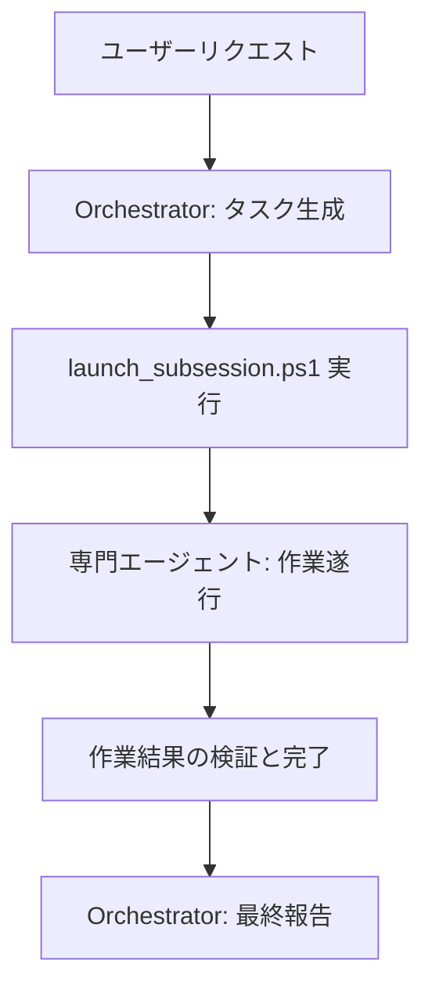

# GIIP Agent System: 自律型マルチエージェントフレームワーク 🤖

[English](readme_en.md) | [한국어](README.md)

[](https://opensource.org/licenses/Apache-2.0)
[](http://makeapullrequest.com)
[](#-コア原則)
[](https://aistudio.google.com/app/apikey)

**GIIP Agent System**は、複雑なソフトウェア開発およびタスク自動化のために設計された**自律型マルチエージェントフレームワーク (Autonomous Multi-Agent Framework)** のみを独立して抽出して作成されたエージェントです。

皆さんのノウハウや用途に応じてロールの内容を修正して使用することで、自分だけのエージェントシステムを構築できます。

基本的には、Google Gemini APIを活用してオーケストレーター (Orchestrator) と専門のサブエージェントが協調する最先端のAIワークフローを提供します。
Google Gemini APIを使用しない場合は、手動で安価に使用できます。また、他のAPIを使用したい場合は、オーケ스트レーターに指示するだけで、皆さんの環境に合わせていくらでも変更してくれます。

このフレームワークは、**Claude Codeのskills**や**OpenCode**に類似した**ロールベースのサブエージェント (Role-based Sub-Agents)** の概念を採用しており、複雑なタスクを精巧に分担して解決します。

特に **Antigravity Tool**に最適化されて設計されており、別途のサードパーティツールのインストールなしに、既存の開発ツールとPowerShell環境だけで即座に稼働します。Electronベースのターミナル環境でも優れた安定性と互換性を提供します。

韓国の開発者エコシステム (Korean Developer Ecosystem) に最適化されており、すべてのプロセスとドキュメント化は **Korean-First** (韓国語優先) 原則に従います。


## ✨ 主な機能 (Key Features)

- **Multi-Agent Collaboration**: Claude Code/OpenCodeスタイルのロールベースの協調。
- **Superpowers Native**: Plan、TDD、Systematic Debuggingなどの高度なエンジニアリングスキルを内蔵。
- **Multi-Platform Ready**: Cursor、GitHub Copilot、Claudeなど、さまざまなAIツールと即座に互換。
- **Autonomous Development**: 要件分析から実装、検証まで、自律的なタスク遂行。
- **Antigravity Optimized**: Antigravityツールとの完璧な同期および最適化されたワークフロー。
- **Zero-Tool Setup**: 追加のツール設定なしに、既存のPowerShell環境で即座に使用可能。
- **Environment Stability**: ElectronベースのPowerShell環境で完璧に動作。
- **Gemini API Native**: 最新のGoogle Geminiモデルを活用した高性能な推論およびコード生成。
- **Korean-First Workflow**: 韓国語ベースのドキュメント化およびエージェント相互作用の最適化。
- **React Best Practices**: VercelのReact Best Practices Rulesを適用し、最適化されたフロントエンドコードを生成。
- **Bkit Vibecoding Kit**: PDCAメソドロジーに基づいた体系的な開発と自動化レポートを提供。

このリポジトリは、GIIP AIエージェントシステムの設定、役割定義、およびワークフローを管理するためのスペースです。

実際に使用するサブエージェント用のロールの定義や、必要な機能のみを `.agent` フォルダに集めているため、既存のプロジェクトにこのリポジトリの内容をそのまま上書きしても、既存のプロジェクトは影響を受けません。

作業しているフォルダにこのリポジトリのファイルとディレクトリをコピーした後、antigravityを起動してください。そして、次のようにチャットを入力すれば準備は完了です。

```
あなたはオーケストレーターです。自分のロールを確認し、以下の業務を分析して、各担当者に作業を委任してください。
もし委任する適切なロールがない場合は、ロールを新規に作成して担当ロールに委任してください。

-- 業務内容 --

```

これで、現在のチャット画面から業務指示ができるようになります。

## 🤝 互換性 (Compatibility)

このプロジェクトは、さまざまなAIエージェント環境をサポートしています。
- **Antigravity**: `GEMINI.md` 自動認識
- **Cursor / Windsurf**: `.cursorrules` 自動認識
- **GitHub Copilot**: `COPILOT_INSTRUCTIONS.md` 自動認識
- **Claude / OpenCode**: `SETUP_AGENTS.md` ガイドによる簡単設定

## 🛠️ 事前準備事項 (Prerequisites)

このシステムを使用するために、以下のツールがインストールされている必要があります。

1. **PowerShell 7+**: [インストールガイド](https://learn.microsoft.com/ja-jp/powershell/scripting/install/installing-powershell-on-windows)
2. **Node.js**: [公式サイト](https://nodejs.org/)でLTSバージョンを推奨します。
3. **Gemini CLI**: ターミナルで以下のコマンドを実行して、グローバルにインストールしてください。
   ```powershell
   npm install -g @google/gemini-cli
   ```

## ⚙️ 初期設定 (Setup & Configuration)

### 1. API Key 設定
Gemini APIを使用するために、API Keyの設定が必要です。
（手動開始のみを使用する場合は必要ありません。）

まず、antigravityツールでエージェントスクリプトを分析し、setting.jsonのサンプルファイルを作成するように依頼すると、ファイルが作成されます。

1. [Google AI Studio](https://aistudio.google.com/app/apikey)でAPI Keyを発行します。
2. プロジェクトルートの `.agent/settings.json.sample` ファイルを同じフォルダに `settings.json` としてコピーします。
3. コピーした `settings.json` ファイルを開き、`"YOUR_GEMINI_API_KEY_HERE"` の部分を発行された実際のキーに置き換えます。

> [!NOTE]
> `launch_subsession.ps1` スクリプトは、プロジェクト内の `.agent/settings.json` を最初に確認し、ない場合はユーザーのホームディレクトリ (`~/.gemini/settings.json`) を参照します。

## 📁 ディレクトリ構造 (Directory Structure)

```text
.agent/
├── roles/          # 各エージェント (Developer, Testerなど) のペルソナと責任の定義
├── dispatch/       # タスク定義ファイル (TASK_YYYYMMDD-ID.md)
├── scripts/        # [システム運用のためのPowerShellスクリプトツール](./.agent/scripts/README.md)
├── work_history/   # 作業履歴の記録 (ルール遵守)
└── README.md       # システム詳細ガイド (英文)
```

## 🚀 主な使用法 (Basic Usage)

命令を下した後に、バックグラウンドでサブエージェントセッションを開始する2つの方法があります。2つのうちいずれかを実行すると、各役割のサブエージェントが作業を開始します。

### 1. 自動開始 (gemini-cli 使用時)
保留中のタスクを自動的に検出し、適切な役割で `gemini-cli` セッションを即座に開始します。
```powershell
.\.agent\scripts\launch_subsession.ps1
```

- 定期的な自動実行 (バッチファイルを使用)
エージェントを5分ごとに自動的に確認して、作業を実行するように設定できます。
```cmd
.\auto_agent.bat
```
このスクリプトは実行中のウィンドウを維持し、5分 (300秒) 間隔で `launch_subsession.ps1` を繰り返し呼び出しします。

### 2. 手動開始 (クリップボードハンドオフ)
`gemini-cli` なしでエージェントマネージャなどの環境で新しいセッションとして作業を貼り付けたい場合に使用します。保留中の作業を探し、該当する役割のコンテキストをクリップボードにコピーします。
```powershell
.\.agent\scripts\launch_role.ps1
```
実行後、エージェントと対話中のウィンドウに `Ctrl+V` で貼り付けて作業を開始してください (エージェントマネージャで新しい会話 (左側のプラスボタン) を作成して貼り付けるのが最も確実です)。

## 📊 ステータス確認と監視 (Monitoring & Status)
すべてのタスク의 進行状況と、現在実行中のバックグラウンドプロセスを確認します。
```powershell
.\.agent\scripts\check_status.ps1
```

### 3. 作業履歴の確認
エージェントのすべての作業内容は、`work_history` ディレクトリに日付別に記録されます。

## 🚨 コア原則 (Core Principles)
すべてのエージェントは、以下のルールを厳格に遵守します。
1.  **Evidence First**: 技術的な根拠は常にマークダウンファイルへのリンクとして提示します。
2.  **Korean First**: すべての成果物とドキュメントは韓国語で作成することを原則とします。
3.  **Clean Code**: 読みやすくメンテナンスが容易なコードを作成し、不要な重複を排除します。

## 🔄 エージェントワークフロー (Agent Workflow)



1.  **オーケストレーター**がリクエストを分析し、`dispatch` ディレクトリにタスクを作成します。
2.  ユーザーまたはシステムが `launch_subsession.ps1` を実行します。
3.  **サブエージェント** (例: Developer, Tester) が作業を遂行し、ステータスを `Completed` に更新します。
4.  **オーケストレーター**が最終成果物を検証します。

## 📦 Bkit Vibecoding Kit Integration

**Bkit**は、PDCA (Plan-Design-Do-Check-Act) メソドロジーをエージェントワークフローに結合し、開発効率と品質を最大化するVibecoding Kitです。

- **PDCA Loop**: `/pdca plan`、`/pdca design`、`/pdca analyze` などのコマンドによる体系的な開発プロセス管理。
- **Gap Analysis**: 実装内容と設計内容の差分を自動的に分析し、品質を確保。
- **自動化されたレポート**: すべての作業結果に対する標準化されたレポートを提供。

詳細な使用方法は、[.gemini/README.md](.gemini/README.md) または [GEMINI.md](GEMINI.md) を参照してください。

## 📚 追加ドキュメントとガイド

- **[Antigravity 使用ガイド](ANTIGRAVITY_USAGE_GUIDE.md)**: Antigravityスキルとbkit方法論を効果的に活用する方法を詳しく説明します。PDCAサイクル、システマティックなデバッグ、TDDなど、高度な開発パターンを取り扱います。
- **[プロンプト例](prompt_example.md)**: エージェントを効率的に活用するための様々なプロンプト例を提供します。開発段階別、プラットフォーム別のスキル使用方法や、複合プロンプトの作成方法を含みます。

> [!TIP]
> **簡単な翻訳**: これらのドキュメントを母国語で読みたい場合は、AIアシスタント（ChatGPT、Claude、Geminiなど）に翻訳を依頼するだけです。例えば：「このドキュメントを[あなたの言語]に翻訳してください」。これにより、あなたが快適に感じる任意の言語でコンテンツに簡単にアクセスできます。

## 🦸 Superpowers Integration

このフレームワークは、[Superpowers](https://github.com/obra/superpowers) システムを内蔵しており、エージェントが単なるコーディングマシンではなく、**責任感のある技術者**のように行動するように設計されています。

- **Subagent Driven Development**: 1つの複雑なタスクを「実装」->「仕様検討」->「コード品質検討」の3段階のパイプラインで処理します。
- **Writing Plans**: コードを触る前に `implementation_plan.md` を作成して設計を検証します。
- **Test Driven Development (TDD)**: `Red` -> `Green` -> `Refactor` サイクルを通じて欠陥のないコードを作成します。
- **Systematic Debugging**: 無造作な修正ではなく、仮説検証型のデバッグで根本原因を解決します。

## 🌐 GIIP Enterprise Managed Service

より強力で安定したシステム運用が必要ですか？ **GIIP**は、インフラの自動管理およびセキュリティ脅威の検出のために、専門家とAIのコラボレーションモデルを提供します。

- **インフラ自動化**: 反復的な運用業務をAIが代行します。
- **セキュリティ脅威検出**: リアルタイムで脅威を感知し、迅速に対応します。
- **専門家コラボレーション**: AIの効率性と専門家の判断力を組み合わせて、最高の品質を保証します。

複雑な管理は専門家に任せ、ビジネスの本質に集中してください。

👉 [GIIP公式ホームページを訪問する](https://giip.littleworld.net/)

## 🙏 Special Thanks

このプロジェクトを助けてくださった方々に感謝します。

- [Roy Koo](https://www.linkedin.com/in/roykoo99/)
  - multi api key のアイデア
- [코드깎는노인 (コードを削る老人)](https://www.youtube.com/@%EC%BD%94%EB%93%9C%EA%B9%8E%EB%8A%94%EB%85%B8%EC%9D%B8)
  - react用検査ロジック
- [superpowers](https://github.com/obra/superpowers)
  - 開発検証ロジックを強化
- [bkit Vibecoding Kit](https://github.com/popup-studio-ai/bkit-claude-code) (Licensed under Apache 2.0)
  - PDCAメソドロジーに基づいた開発の最適化
