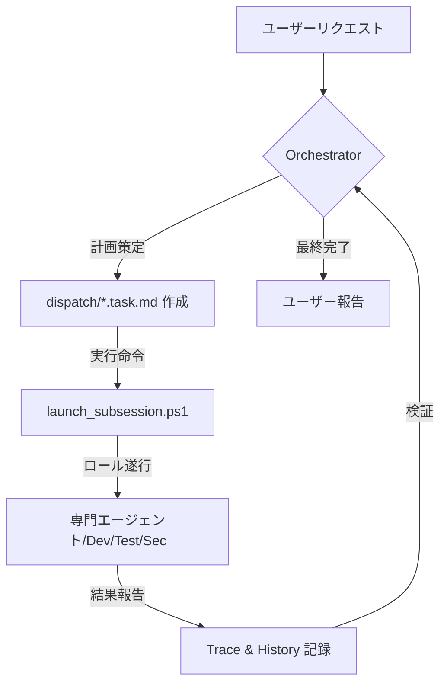

# GIIP Agent System: 自律型マルチエージェントフレームワーク 🤖

[한국어](README.md) | [English](readme_en.md)

[](https://opensource.org/licenses/Apache-2.0)
[](#-핵심-규칙)
[](https://aistudio.google.com/app/apikey)
[](https://github.com/popup-studio-ai/bkit-claude-code)

**GIIP Agent System**は、複雑なソフトウェア開発とタスク自動化のために設計された**自律型マルチエージェントフレームワーク**です。単なるコーディングアシスタントを超え、自ら計画し（Plan）、検証し（Check）、継続的に自己最適化する（AI-Optimize）「思考する開発チーム」を、あなたのプロジェクトに即座に投入できます。

---

## 🎯 導入の入り口 (Gateway)

> **🚀 はじめてですか？**  
> [**クイックスタートガイド**](QUICK_START.md)で、5分で最初のエージェントを稼働させてみましょう！  
> [ツールダウンロード](TOOLS_DOWNLOAD.md) | [Antigravity使用法](ANTIGRAVITY_USAGE_GUIDE.md) | [便利なリンク](links.md)

---

## 👥 対象ユーザー (Target Audience)

- **AIネイティブ開発者**: ペアプログラミングを超えて、エージェントチーム全体を管理したい方。
- **スタートアップ & MVPチーム**: 最小限の人数で、高品質なコードと体系的なドキュメントを同時に確保したいチーム。
- **複雑なレガシー管理者**: Systematic DebuggingとTDDを通じて、安全にコードをリファクタリングしたい方。
- **自動化マニア**: 繰り返しの運用業務を信頼できるエージェントに委任したい方。

---

## ✨ なぜ GIIP Agent System なのか？ (Key Strengths)

1.  **Zero-Tool Setup**: 追加のサードパーティツールをインストールすることなく、PowerShellと既存のAI開発ツール（Cursor、Antigravityなど）だけで即座に起動します。
2.  **Korean-First Workflow**: 韓国の開発エコシステムに最適化されており、韓国語のドキュメント化と相互作用において圧倒的なパフォーマンスを発揮します。
3.  **Advanced Engineering DNA**: Bkit (PDCA)、Superpowers (TDD/Debugging)、Gstack (セキュリティ/安全性) など、実証済みのフレームワークの精髄を一つに統合しました。
4.  **Native Optimization**: LinuxやWSL2なしで、Windows環境で完全な実行追跡（Trace）および自己プロンプト最適化（AI-Optimize）をサポートします。
5.  **Unobtrusive Transplant**: 既存のプロジェクトフォルダに `.agent` フォルダをコピーするだけで、即座にエージェントシステムが活性化されます。

---

## 🚀 既存プロジェクトに即座に適用する

プロジェクトフォルダに移動し、以下のコマンドを実行して GIIP Agent システムを有効にします (** .git フォルダは除く**)。

### Windows (PowerShell)
```powershell
# 必須ファイルのコピー (giip-dev-agentフォルダ内で実行、または相対パスを指定)
Copy-Item -Path ".agent", "GEMINI.md", ".cursorrules", "COPILOT_INSTRUCTIONS.md" -Destination "あなたのプロジェクトパス" -Recurse -Force
```

### Mac/Linux
```bash
# 必須ファイルのコピー (rsync推奨)
rsync -av --exclude='.git' .agent GEMINI.md .cursorrules COPILOT_INSTRUCTIONS.md あなたのプロジェクトパス/
```

> [!TIP]
> 適用後、AIツール（Antigravity、Cursorなど）に次のように指示してみてください：**「君はオーケストレーターだ。GEMINI.mdを読んで、現在のタスクを分析してくれ。」**

---

## 🧠 コアコンセプトとワークフロー

GIIP Agent Systemは、**オーケストレーター (Orchestrator)** が全体の戦略を立て、**サブエージェント (Sub-Agents)** がそれぞれの専門分野でタスクを実行する構造です。



---

## 🛠️ 強力なエコシステム統合 (Advanced Capabilities)

GIIP Agent Systemは、単なるプロンプトの集まりではなく、世界クラスのエージェントテクノロジーの集大成です。

### 1. Bkit Vibecoding Kit (PDCA)
- **Plan-Design-Do-Check-Act**: 実装前に設計 (Design) と分析 (Analyze) の段階を経ることで、「作りながら考える」ミスを防ぎます。
- **`/pdca` コマンド**: 体系的なレポーティングとギャップ分析を自動化します。

### 2. Superpowers Engineering
- **Subagent-Driven**: 一つのタスクを `設計` -> `実装` -> `検証` のパイプラインに分断。
- **Strong Skills**: TDD (Test Driven Development)、Systematic Debugging、Brainstormingスキルが内蔵されています。

### 3. Gstack (Safety & Security)
- **Founder Mode**: `/office-hours` や `/ceo-review` を通じて、製品の本質とUXを再定義します。
- **Guardrails**: 破壊的なコマンドの前の警告 (`/careful`) や作業範囲の制限 (`/freeze`) により、安全な開発環境を提供します。
- **Security Audit**: `/cso` コマンドで STRIDE/OWASP ベースのセキュリティ検査を実行します。

### 4. Native Optimization & Tracing
- **`/native-trace`**: AIの推論過程とツール呼び出し履歴のすべてを自動で記録します。
- **`/aioptimize`**: 収集されたデータを基に、エージェントが自らプロンプトを修正し、より賢くなります。

### 5. K-Layer Knowledge System (Karpathy Diagram)
- **Source-linked Knowledge**: エージェントの作業履歴から再利用可能なパターンと教訓を `Claim` 単位で自動抽出し、蓄積します。
- **自己強化ループ**: すべての知識は元の証拠（Trace/Source）と紐付けられており、次の作業時にエージェントがこれを参照することで、より賢く行動します。
- [K-Layerの仕組み](.agent/skills/k-layer/SKILL.md) | [ナレッジベース](.agent/knowledge/README.md)

---

## ⚙️ 運用と使用法 (Quick Guide)

| タスク | コマンド (PowerShell) | 説明 |
| :--- | :--- | :--- |
| **自動実行** | `.\.agent\scripts\launch_subsession.ps1` | 待機中のタスクを検知し、バックグラウンドセッションを開始 |
| **手動ハンドオフ** | `.\.agent\scripts\launch_role.ps1` | タスクのコンテキストをクリップボードにコピー（他のチャット用） |
| **状態確認** | `.\.agent\scripts\check_status.ps1` | 進行中の全タスクとバックグラウンドプロセスを監視 |
| **自動モニタリング** | `.\auto_agent.bat` | 5分間隔で待機タ스크をチェックし、自動実行 |

> [!IMPORTANT]
> **API Keyの設定 (自動化に必要)**:  
> `.agent/settings.json.sample` ファイルを `settings.json` にコピーし、発行された Gemini API Key を入力してください。

---

## 🌐 GIIP Enterprise & Support

専門的なサーバー構築やAIベースのインフラ管理が必要ですか？
- **公式ホームページ**: [giip.littleworld.net](https://giip.littleworld.net/)
- **お問い合わせ**: contact@littleworld.net

---

## 🙏 Special Thanks

このシステムは、以下のプロジェクトからインスピレーションを受けて構築されました：
- **[Superpowers](https://github.com/obra/superpowers)** (Engineering Rigor)
- **[Bkit](https://github.com/popup-studio-ai/bkit-claude-code)** (PDCA Methodology)
- **[Gstack](https://github.com/garrytan/gstack)** (Product Thinking & Safety)
- **[Agent Lightning](https://github.com/microsoft/agent-lightning)** (Tracing & APO)

---
© 2026 GIIP Agent System. Optimized for Antigravity & AI-Native Builders.
