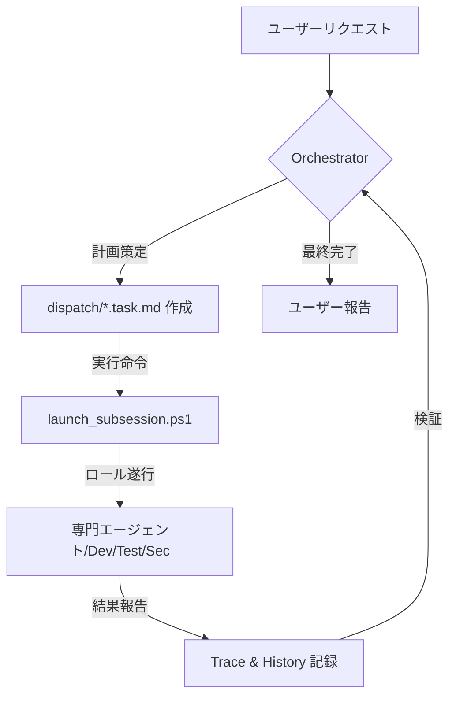

# giip FDE Agent 🤖📦

**あなたのPCにインストールされる、フォワードデプロイ型（Forward-Deployed）のAIエンジニアリングチーム**

> 🆕 **[What's New（最近の更新）](docs/WHATS_NEW.md)** · 直近7日以内の更新をこちらで確認できます。

[](README.md)
[](readme_jp.md)
[](readme_en.md)
[](readme_zh.md)

> [!TIP]
> このリポジトリをダウンロードした後、ご自身の言語のファイルがなく韓国語のファイルのみが存在する場合は、AIエージェント（Antigravity、Cursorなど）に翻訳を依頼してください。

[](https://opensource.org/licenses/Apache-2.0)
[](https://en.wikipedia.org/wiki/Forward_Deployed_Engineer)
[](https://aistudio.google.com/app/apikey)
[](https://github.com/popup-studio-ai/bkit-claude-code)

---

## FDE Agent とは？

**FDE（Forward Deployed Engineer）** とは、遠隔から支援するのではなく、**顧客の現場に直接配置され**、その組織の課題を共に解決するエンジニアを指します。Palantir が生み出した用語で、要件分析から設計・実装・統合・デプロイまでの全ライフサイクルを顧客のすぐそばで担うのが特徴です。([Wikipedia](https://en.wikipedia.org/wiki/Forward_Deployed_Engineer))

**giip FDE Agent** は、この概念を AI エージェントとして実装したものです。人の代わりに **AI エンジニアリングチームがあなたのPC（＝現場）に常駐**し、`.agent` フォルダ一つで移植され、自ら計画し（Plan）実装し（Do）検証し（Check）自己最適化する（Act）**「思考するエージェントチーム」** をプロジェクトに即座に投入します。データとコンテキストはローカルから外に出ません。

このエージェントは、giip の FDE 能力 ― AI 駆動のフルサイクル開発とエンタープライズ運用 ― を一つにまとめて提供する [**giip FDE Box**](https://giip.littleworld.net/docs/plans/AIFDEOpsProposalja.html) の実行主体です。インフラ運用から AI ネイティブ開発まで、エンタープライズ運用の全周期をローカル環境で実行します。

> 💡 **インストールや設定の知識がまったくなくても大丈夫です。** [**giip FDE Box**](https://giip.littleworld.net/docs/plans/AIFDEOpsProposalja.html) を
> 申し込むだけで、専門家が giip FDE Agent のインストール・連携を代行し、あなたはすぐに自由に使い始められます。

---

## 🚀 はじめてですか？ (Gateway)

> [**クイックスタートガイド**](QUICK_START.md)で、5分で最初のエージェントを稼働させてみましょう！
>
> [ツールダウンロード](TOOLS_DOWNLOAD.md) · [Antigravity使用法](ANTIGRAVITY_USAGE_GUIDE.md) · [90分オンボーディング](docs/00-onboarding/README.md) · [運用ガバナンス](docs/60-operations/README.md) · [Slack ボット連携](slack-bot/SLACK_APP_SETUP.md) · [便利なリンク](links.md)

---

## 💻 自分のPCに FDE Agent をインストールする — まず Slack ボットを起動する

`giip-fde-agent` は **public リポジトリ**です。したがってこのリポジトリのフォルダ内で直接作業するのではなく、
**リポジトリを取得 → あなたが作業メインで使うフォルダへ必要ファイルをコピー → そのフォルダをワークスペースとして Slack ボットを起動する**
のが最も速く安全なスタートです。こうすればアップデート時にリポジトリを再 pull しても、あなたの作業物と混ざりません。

以下の手順どおりに進めれば、**Slack で `@ボット <依頼>` と話しかけて FDE Agent に仕事を任せられる状態**まで到達します。

### 事前準備 (Prerequisites)

- **Node.js 18+** (`node -v`)
- **Claude CLI** のインストールとログイン — ボットは Anthropic API Key なしで `claude -p` CLI をそのまま駆動します。
  `claude --version` が動作し、一度ログイン（`claude` 実行後に認証）済みである必要があります。→ [Claude Code](https://claude.ai/code)
- **Slack ワークスペースの管理者権限**（アプリをインストールできること）

---

### ステップ1. リポジトリ取得 & 作業メインフォルダへコピー

まずリポジトリをクローンし、**あなたが作業メインで使うフォルダ**（例: `C:\work\my-project`）を作成して、そこへエージェントファイルをコピーします（**`.git` フォルダは除く**）。

#### Windows (PowerShell)
```powershell
# 1) リポジトリをクローン（任意の場所）
git clone https://github.com/LowyShin/giip-fde-agent.git

# 2) 作業メインフォルダを作成（パスは自由）
New-Item -ItemType Directory -Force "C:\work\my-project"

# 3) エージェント + slack-bot ファイルを作業フォルダへコピー
cd giip-fde-agent
Copy-Item -Path ".agent", "GEMINI.md", ".cursorrules", "COPILOT_INSTRUCTIONS.md", "slack-bot" -Destination "C:\work\my-project" -Recurse -Force
```

#### Mac/Linux
```bash
# 1) リポジトリをクローン
git clone https://github.com/LowyShin/giip-fde-agent.git

# 2) 作業メインフォルダを作成
mkdir -p ~/work/my-project

# 3) エージェント + slack-bot ファイルをコピー (.git は除く)
cd giip-fde-agent
rsync -av --exclude='.git' .agent GEMINI.md .cursorrules COPILOT_INSTRUCTIONS.md slack-bot ~/work/my-project/
```

> 以降のすべての作業は **コピーした作業フォルダ**（`C:\work\my-project`）で行います。元の `giip-fde-agent` フォルダはアップデート受信用に残しておいてください。

---

### ステップ2. Slack アプリを作成する (Socket Mode)

ボットは公開 URL が不要な **Socket Mode** で動作します。[api.slack.com/apps](https://api.slack.com/apps) でアプリを作成し、以下の2つのトークンを発行してください。

1. **Create New App → From scratch** でアプリ作成
2. **Socket Mode** を有効化 → App-Level Token を生成（スコープ `connections:write`）→ `xapp-...` をコピー
3. **OAuth & Permissions → Bot Token Scopes**: `chat:write`, `app_mentions:read`, `channels:history`, `channels:read`, `groups:history`, `im:history`, `im:read`, `im:write`, `users:read`
4. **Event Subscriptions** を有効化 → Subscribe to bot events: `app_mention`, `message.im`, `message.channels`, `message.groups`
5. **Install to Workspace** → インストール後 **Bot User OAuth Token** `xoxb-...` をコピー

> スクリーンショットレベルの詳細ガイドは [`slack-bot/SLACK_APP_SETUP.md`](slack-bot/SLACK_APP_SETUP.md) を参照してください。

---

### ステップ3. slack-bot のインストール & `.env` 設定

作業フォルダ内の `slack-bot` に入り、依存関係をインストールして `.env` を埋めます。

```powershell
cd C:\work\my-project\slack-bot
npm install
Copy-Item .env.example .env   # (Mac/Linux: cp .env.example .env)
```

`.env` で最低3つの値を埋めれば動きます。

```env
SLACK_BOT_TOKEN=xoxb-...                 # ステップ2-5でコピーした Bot Token
SLACK_APP_TOKEN=xapp-...                 # ステップ2-2でコピーした App-Level Token
WORKSPACE_DIR=C:\work\my-project         # ステップ1で作った作業フォルダ (.agent がある場所)

# 任意
# SLACK_CHANNEL_IDS=C0123456789          # ボットが聞くチャンネルID（未指定でも DM は常に動作）
# BOT_NAME=My Team Bot
# GITHUB_TOKEN=ghp_...                    # !issues コマンド用 GitHub PAT (repo scope)
# GITHUB_REPO=your-org/your-repo
```

> `WORKSPACE_DIR` は **`.agent/` が入っている作業フォルダ**を指す必要があります。ボットはこのフォルダを基準にタスクを処理し、git push します。

---

### ステップ4. ボットを起動する

```powershell
node index.js
```

`Socket Mode connected` のログが出れば成功です。常時起動させるには **pm2** での常駐を推奨します。

```powershell
npm install -g pm2
pm2 start index.js --name giipclaude-bot
pm2 save
pm2 logs giipclaude-bot     # ログ確認
```

---

### ステップ5. チャンネルに招待して使う

ボットを使いたいチャンネルに招待してからメンションします。

```
/invite @<ボット名>

@<ボット名> 設定ページにダークモードトグルを追加して
→ ボットが依頼を分析し、タスク計画（ID付き）を投稿

go 20240601120000
→ サブエージェントが実行後 git push し、結果の GitHub URL を返信
```

その他コマンド: `tasklist`（待機タスク）, `cancel <taskID>`, `!issues`, DM で直接会話 など。
使い方の全体は [`slack-bot/README.md`](slack-bot/README.md) にあります。

---

> [!TIP]
> Slack ボットなしで **AIツール（Antigravity、Cursorなど）で直接**使いたい場合は、ステップ1のコピーだけで十分です。
> AIツールに次のように指示してみてください：
> **「君はオーケストレーターだ。GEMINI.mdを読んで、現在のタスクを分析してくれ。」**

> [!IMPORTANT]
> **Gemini API Keyの設定**（画像生成など `.agent` 自動化に必要、手動作業には不要）:
> `.agent/settings.json.sample` を `settings.json` にコピーし、発行された Gemini API Key を入力してください。
> （Slack ボットのタスク駆動自体は Claude CLI を使うため、このキーがなくても動きます。）

---

## 🧠 どのように動作するか (How It Works)

FDE Agent は、**オーケストレーター (Orchestrator)** が全体の戦略を立て、**サブエージェント (Sub-Agents)** がそれぞれの専門分野でタスクを実行する構造です。



4つの主要要素（ロール・ルール・スキル・ワークフロー）の詳細は
👉 [**システムアーキテクチャガイド**](docs/02-design/agent-components/overview.md)を参照してください。

---

## ✨ なぜ FDE Agent なのか？ (Key Strengths)

1. **Zero-Tool Setup**: サードパーティツールのインストールなしに、PowerShellと既存のAI開発ツール（Cursor、Antigravityなど）だけで即座に起動します。
2. **Local-First / Forward-Deployed**: エージェントが現場（PC）に常駐し、コード・インフラ・ドキュメントのすぐそばで直接作業します。
3. **Korean-First Workflow**: 韓国の開発エコシステムに最適化されており、韓国語のドキュメント化と相互作用において圧倒的です。
4. **Advanced Engineering DNA**: Bkit (PDCA)、Superpowers (TDD/Debugging)、Gstack (セキュリティ/安全性) の精髄を統合しました。
5. **Native Optimization**: LinuxやWSL2なしで、Windows環境で実行追跡（Trace）と自己プロンプト最適化（AI-Optimize）をサポートします。

### 👥 対象ユーザー
- **AIネイティブ開発者**: ペアプログラミングを超えて、エージェントチーム全体を管理したい方。
- **スタートアップ & MVPチーム**: 最小限の人数で、高品質なコードと体系的なドキュメントを同時に確保したいチーム。
- **複雑なレガシー管理者**: Systematic DebuggingとTDDを通じて、安全にコードをリファクタリングしたい方。
- **自動化マニア**: 繰り返しの運用業務を信頼できるエージェントに委任したい方。

---

## 🛠️ サポートされているツール (Supported Tools)

FDE Agent は、以下の最新AI開発ツールと完璧に互換性があります。

| ツール | 説明 | 詳細ガイド |
| :--- | :--- | :--- |
| **Antigravity** | Google Geminiベースのプロフェッショナル向けエージェントプラットフォーム | [詳細を見る](docs/04-tools/antigravity.md) |
| **Claude Code** | AnthropicのCLIベース・エージェンティック・コーディングツール | [詳細を見る](docs/04-tools/claude-code.md) |
| **Codex** | OpenAIのエージェンティック・コーディングプラットフォーム（マルチ環境対応） | [詳細を見る](docs/04-tools/codex.md) |
| **Cursor** | コードベース全体を理解するAIネイティブエディタ | [詳細を見る](docs/04-tools/cursor.md) |
| **Gemini CLI** | 最速かつ軽量なターミナル用AIユーティリティ | [詳細を見る](docs/04-tools/gemini-cli.md) |
| **Windsurf** | フロー (Flow) 中心のインテリジェント・エージェンティックIDE | [詳細を見る](docs/04-tools/windsurf.md) |
| **VS Code** | Autopilot自律モードをサポートする標準エディタ | [詳細を見る](docs/04-tools/vscode.md) |
| **OpenClaw** | エージェントをメッセンジャー (Slack等) と接続するゲートウェイ | [詳細を見る](docs/04-tools/openclaw_ja.md) |

---

## ⚙️ 運用と使用法 (Quick Guide)

| タスク | コマンド (PowerShell) | 説明 |
| :--- | :--- | :--- |
| **自動実行** | `.\.agent\scripts\launch_subsession.ps1` | 待機中のタスクを検知し、バックグラウンドセッションを開始 |
| **手動ハンドオフ** | `.\.agent\scripts\launch_role.ps1` | タスクのコンテキストをクリップボードにコピー（他のチャット用） |
| **状態確認** | `.\.agent\scripts\check_status.ps1` | 進行中の全タスクとバックグラウンドプロセスを監視 |
| **自動モニタリング** | `.\auto_agent.bat` | 5分間隔で待機タスクをチェックし、自動実行 |

---

## 🧩 機能一覧

FDE Agent には、実証済みフレームワークの精髄が統合されています。各機能の詳しい仕組み・コマンドは
👉 [**高度な機能ガイド (CAPABILITIES_ja.md)**](docs/CAPABILITIES_ja.md)を参照してください。

| # | 機能 | 概要 |
| :-: | :--- | :--- |
| 1 | **Bkit PDCA** | 設計・分析してから実装する `/pdca` サイクルで「作りながら考える」ミスを防止 |
| 2 | **Superpowers** | 設計→実装→検証パイプライン + TDD・Systematic Debugging 内蔵 |
| 3 | **Gstack 安全/セキュリティ** | `/careful`・`/freeze` ガードレール、`/cso` STRIDE/OWASP セキュリティ監査 |
| 4 | **Native Trace/Optimize** | `/native-trace` で推論を記録、`/aioptimize` でプロンプト自己改善 |
| 5 | **K-Layer ナレッジ** | 作業履歴から再利用パターンを `Claim` として抽出・蓄積する自己強化ループ |
| 6 | **design-md デザイン探索** | 4プラットフォーム統合、有名ブランドのスタイルを即座に移植 |
| 7 | **OpenClaw メッセンジャー制御** | Slack・Discord・Telegram でリモート照会・作業指示 |
| 8 | **Vibe Investing** | 外部投資レポを5軸評価して安全に統合 |
| 9 | **Agency 専門家チーム** | Workflow Architect などの専門家ペルソナ + プレミアム UI/UX |
| 10 | **keep-codex-fast** | Codex のローカル状態を点検・整理し速度低下を防止 |

> コーディング前の行動原則（Think Before Coding / Simplicity First / Surgical Changes / Goal-Driven）は
> [Karpathy ガイドライン](.agent/rules/10_karpathy_guidelines.md)に従います。

---

## 🌐 GIIP Enterprise & Support

専門的なサーバー構築やAIベースのインフラ管理が必要ですか？
- **giip FDE Box 提案書**: [한국어](https://giip.littleworld.net/docs/plans/AIFDEOpsProposalko.html) · [日本語](https://giip.littleworld.net/docs/plans/AIFDEOpsProposalja.html) · [English](https://giip.littleworld.net/docs/plans/AIFDEOpsProposalen.html) · [中文](https://giip.littleworld.net/docs/plans/AIFDEOpsProposalzh.html)
- **公式ホームページ**: [giip.littleworld.net](https://giip.littleworld.net/)
- **お問い合わせ**: contact@littleworld.net

---

## 🙏 Special Thanks

このシステムは、以下のプロジェクトからインスピレーションを受けて構築されました：
- **[Superpowers](https://github.com/obra/superpowers)** (Engineering Rigor)
- **[Bkit](https://github.com/popup-studio-ai/bkit-claude-code)** (PDCA Methodology)
- **[Gstack](https://github.com/garrytan/gstack)** (Product Thinking & Safety)
- **[Agent Lightning](https://github.com/microsoft/agent-lightning)** (Tracing & APO)

---
© 2026 giip FDE Agent. Optimized for Antigravity & AI-Native Builders.
