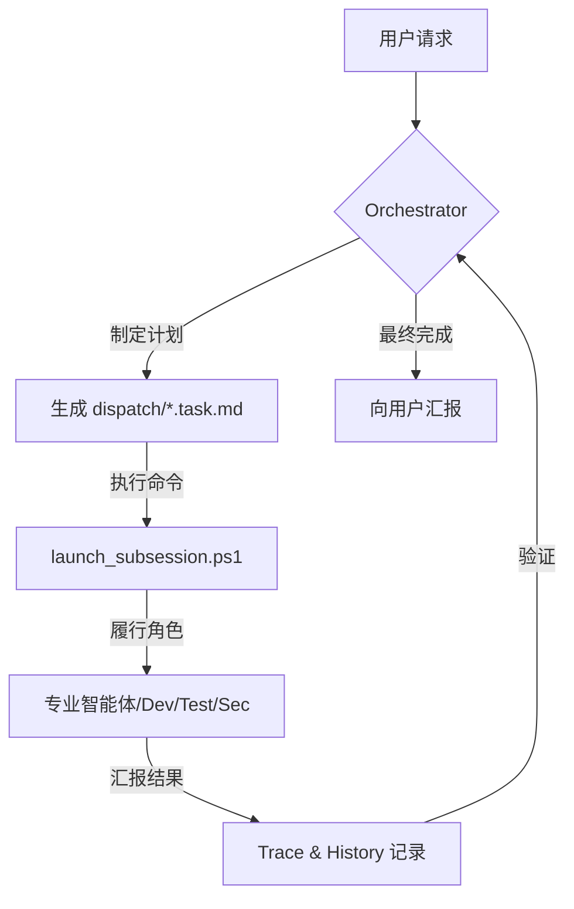

# giip FDE Agent 🤖📦

**安装到您 PC 上的前置部署型（Forward-Deployed）AI 工程团队**

> 🆕 **[What's New — 最新更新](docs/WHATS_NEW.md)** · 在此查看一周内的更新内容。

[](README.md)
[](readme_jp.md)
[](readme_en.md)
[](readme_zh.md)

> [!TIP]
> 下载本仓库后，如果没有您所用语言的文件、仅有韩语文件，请让 AI 智能体（Antigravity、Cursor 等）为您翻译。

[](https://opensource.org/licenses/Apache-2.0)
[](https://en.wikipedia.org/wiki/Forward_Deployed_Engineer)
[](https://aistudio.google.com/app/apikey)
[](https://github.com/popup-studio-ai/bkit-claude-code)

---

## 什么是 FDE Agent？(What is the FDE Agent?)

**FDE（Forward Deployed Engineer，前置部署工程师）** 指的不是远程支持，而是 **被直接派驻到客户现场**、
与该组织一同解决问题的工程师。这是 Palantir 提出的概念，其特点是从需求分析到设计、实现、集成、部署，
在客户身边负责整个生命周期。([Wikipedia](https://en.wikipedia.org/wiki/Forward_Deployed_Engineer))

**giip FDE Agent** 就是把这一理念用 AI 智能体实现的产物。它不是靠人，而是让 **AI 工程团队常驻在您的 PC（＝现场）**，
仅通过一个 `.agent` 文件夹即可移植，自主地进行计划（Plan）、实现（Do）、验证（Check）、自我优化（Act），
把一支 **“会思考的智能体团队”** 立即投入到您的项目中。数据与上下文绝不离开您的本地环境。

该智能体是 [**giip FDE Box**](https://giip.littleworld.net/docs/plans/AI_FDE_Ops_Proposal_zh.html) 的执行主体 ——
giip FDE Box 将 giip 的 FDE 能力（AI 驱动的全周期开发与企业级运维）打包为一体。
从基础设施运维到 AI 原生开发，它在您的本地环境中执行企业运维的整个周期。

> 💡 **即使您完全没有安装或配置知识也没关系。** 只要申请 [**giip FDE Box**](https://giip.littleworld.net/docs/plans/AI_FDE_Ops_Proposal_zh.html)，
> 专家便会代您完成 giip FDE Agent 的安装与集成，您可以立即自由地使用。

---

## 🚀 第一次使用吗？(Gateway)

> 在[**快速开始指南**](QUICK_START.md)中，5 分钟启动您的第一个智能体！
>
> [工具下载](TOOLS_DOWNLOAD.md) · [Antigravity 使用方法](ANTIGRAVITY_USAGE_GUIDE.md) · [90 分钟上手](docs/00-onboarding/README.md) · [运维治理](docs/60-operations/README.md) · [Slack 机器人连接](slack-bot/SLACK_APP_SETUP.md) · [实用链接](links.md)

---

## 💻 在我的 PC 上安装 FDE Agent —— 先把 Slack 机器人跑起来

`giip-fde-agent` 是一个 **public（公开）仓库**。因此请不要直接在该仓库文件夹内工作，而是
**获取仓库 → 把所需文件复制到您作为主工作目录使用的文件夹 → 以该文件夹为工作区启动 Slack 机器人**，
这是最快、最安全的起步方式。这样一来，即使日后重新 pull 仓库获取更新，也不会与您的工作成果混在一起。

按下面的步骤操作，即可到达 **在 Slack 中通过 `@机器人 <请求>` 向 FDE Agent 派活** 的状态。

### 前置条件 (Prerequisites)

- **Node.js 18+** (`node -v`)
- **Claude CLI** 已安装并登录 —— 机器人无需 Anthropic API Key，直接驱动 `claude -p` CLI。
  `claude --version` 必须可用，并且已登录过一次（运行 `claude` 后完成认证）。→ [Claude Code](https://claude.ai/code)
- **Slack 工作区管理员权限**（需要能够安装应用）

---

### 第 1 步。获取仓库 & 复制到主工作目录

先克隆仓库，创建 **您作为主工作目录使用的文件夹**（例如 `C:\work\my-project`），然后把智能体文件复制进去（**排除 `.git` 文件夹**）。

#### Windows (PowerShell)
```powershell
# 1) 克隆仓库（任意位置）
git clone https://github.com/LowyShin/giip-fde-agent.git

# 2) 创建主工作目录（路径随意）
New-Item -ItemType Directory -Force "C:\work\my-project"

# 3) 把 智能体 + slack-bot 文件复制到工作目录
cd giip-fde-agent
Copy-Item -Path ".agent", "GEMINI.md", ".cursorrules", "COPILOT_INSTRUCTIONS.md", "slack-bot" -Destination "C:\work\my-project" -Recurse -Force
```

#### Mac/Linux
```bash
# 1) 克隆仓库
git clone https://github.com/LowyShin/giip-fde-agent.git

# 2) 创建主工作目录
mkdir -p ~/work/my-project

# 3) 复制 智能体 + slack-bot 文件（排除 .git）
cd giip-fde-agent
rsync -av --exclude='.git' .agent GEMINI.md .cursorrules COPILOT_INSTRUCTIONS.md slack-bot ~/work/my-project/
```

> 之后所有工作都在 **复制出来的工作目录**（`C:\work\my-project`）中进行。原始的 `giip-fde-agent` 文件夹仅用于接收更新。

---

### 第 2 步。创建 Slack 应用 (Socket Mode)

机器人以无需公开 URL 的 **Socket Mode** 运行。请在 [api.slack.com/apps](https://api.slack.com/apps) 创建应用并获取下面两个 Token。

1. **Create New App → From scratch** 创建应用
2. 启用 **Socket Mode** → 生成 App-Level Token（scope `connections:write`）→ 复制 `xapp-...`
3. **OAuth & Permissions → Bot Token Scopes**：`chat:write`、`app_mentions:read`、`channels:history`、`channels:read`、`groups:history`、`im:history`、`im:read`、`im:write`、`users:read`
4. 启用 **Event Subscriptions** → Subscribe to bot events：`app_mention`、`message.im`、`message.channels`、`message.groups`
5. **Install to Workspace** → 安装后复制 **Bot User OAuth Token** `xoxb-...`

> 详细到截图级别的指南请参考 [`slack-bot/SLACK_APP_SETUP.md`](slack-bot/SLACK_APP_SETUP.md)。

---

### 第 3 步。安装 slack-bot & 配置 `.env`

进入工作目录中的 `slack-bot`，安装依赖并填写 `.env`。

```powershell
cd C:\work\my-project\slack-bot
npm install
Copy-Item .env.example .env   # (Mac/Linux: cp .env.example .env)
```

在 `.env` 中至少填写 3 个值即可。

```env
SLACK_BOT_TOKEN=xoxb-...                 # 第 2 步 5) 复制的 Bot Token
SLACK_APP_TOKEN=xapp-...                 # 第 2 步 2) 复制的 App-Level Token
WORKSPACE_DIR=C:\work\my-project         # 第 1 步创建的工作目录（.agent 所在处）

# 可选
# SLACK_CHANNEL_IDS=C0123456789          # 机器人监听的频道 ID（不指定时 DM 始终可用）
# BOT_NAME=My Team Bot
# GITHUB_TOKEN=ghp_...                    # !issues 命令用的 GitHub PAT (repo scope)
# GITHUB_REPO=your-org/your-repo
```

> `WORKSPACE_DIR` 必须指向 **包含 `.agent/` 的工作目录**。机器人以该目录为基准处理任务并执行 git push。

---

### 第 4 步。运行机器人

```powershell
node index.js
```

出现 `Socket Mode connected` 日志即为成功。若要保持常开，推荐用 **pm2** 常驻运行。

```powershell
npm install -g pm2
pm2 start index.js --name giipclaude-bot
pm2 save
pm2 logs giipclaude-bot     # 查看日志
```

---

### 第 5 步。邀请到频道并使用

在想要使用机器人的频道中邀请它，然后 @提及 即可。

```
/invite @<机器人名称>

@<机器人名称> 在设置页面加一个深色模式开关
→ 机器人分析请求并发布任务计划（含 ID）

go 20240601120000
→ 子智能体执行后 git push，并回复结果的 GitHub URL
```

其他命令：`tasklist`（待处理任务）、`cancel <taskID>`、`!issues`、通过 DM 直接对话等。
完整用法见 [`slack-bot/README.md`](slack-bot/README.md)。

---

> [!TIP]
> 如果不使用 Slack 机器人，而想 **直接用 AI 工具（Antigravity、Cursor 等）**，只做第 1 步的复制就足够了。
> 可以这样对 AI 工具下指令：
> **“你是编排者（Orchestrator）。请阅读主指令书（GEMINI.md）并分析当前任务。”**

> [!IMPORTANT]
> **Gemini API Key 配置**（图像生成等 `.agent` 自动化时需要，手动操作时不需要）：
> 把 `.agent/settings.json.sample` 复制为 `settings.json`，并填入您申请到的 Gemini API Key。
> （Slack 机器人的任务驱动本身使用 Claude CLI，因此没有此 Key 也能运行。）

---

## 🧠 工作原理 (How It Works)

FDE Agent 的结构是：由 **编排者（Orchestrator）** 制定整体策略，
**子智能体（Sub-Agents）** 各自在其专业领域内执行任务。



关于构成智能体的四大要素（角色·规则·技能·工作流）的详情，
👉 请参考 [**系统架构指南**](docs/02-design/agent-components/overview.md)。

---

## ✨ 为什么选择 FDE Agent？(Key Strengths)

1. **Zero-Tool Setup**：无需安装第三方工具，仅用 PowerShell 与既有 AI 开发工具（Cursor、Antigravity 等）即可立即运行。
2. **Local-First / Forward-Deployed**：智能体常驻现场（PC），在代码·基础设施·文档旁直接工作。
3. **Korean-First Workflow**：针对韩国开发生态优化，在中文/韩文文档化与交互性方面表现出色。
4. **Advanced Engineering DNA**：融合了 Bkit(PDCA)、Superpowers(TDD/Debugging)、Gstack(安全/防护) 的精华。
5. **Native Optimization**：无需 Linux·WSL2，在 Windows 环境下即支持执行追踪(Trace)与提示词自我优化(AI-Optimize)。

### 👥 适合这些人 (Target Audience)
- **AI Native 开发者**：想超越结对编程、去管理智能体团队的人
- **初创 & MVP 团队**：想以最少人手同时获得高质量代码与体系化文档的团队
- **遗留系统管理者**：想用 Systematic Debugging 与 TDD 安全重构的人
- **自动化爱好者**：想把重复运维工作交给可信赖智能体的人

---

## 🛠️ 支持的工具 (Supported Tools)

FDE Agent 与下列最新 AI 开发工具完全兼容。

| 工具 | 说明 | 详细指南 |
| :--- | :--- | :--- |
| **Antigravity** | 基于 Google Gemini 的专家级智能体平台 | [查看](docs/04-tools/antigravity.md) |
| **Claude Code** | Anthropic 的 CLI 智能体编码工具 | [查看](docs/04-tools/claude-code.md) |
| **Codex** | OpenAI 的智能体编码平台（多环境） | [查看](docs/04-tools/codex.md) |
| **Cursor** | 理解整个代码库的 AI 原生编辑器 | [查看](docs/04-tools/cursor.md) |
| **Gemini CLI** | 最快、最轻量的终端 AI 工具 | [查看](docs/04-tools/gemini-cli.md) |
| **Windsurf** | 以流程(Flow)为中心的智能体 IDE | [查看](docs/04-tools/windsurf.md) |
| **VS Code** | 支持 Autopilot 自主模式的标准编辑器 | [查看](docs/04-tools/vscode.md) |
| **OpenClaw** | 把智能体连接到即时通讯（Slack 等）的网关 | [查看](docs/04-tools/openclaw.md) |

---

## ⚙️ 运维与用法 (Quick Guide)

| 操作 | 命令 (PowerShell) | 说明 |
| :--- | :--- | :--- |
| **自动执行** | `.\.agent\scripts\launch_subsession.ps1` | 检测待处理任务并启动后台会话 |
| **手动交接** | `.\.agent\scripts\launch_role.ps1` | 把任务上下文复制到剪贴板（用于转到其他聊天窗口） |
| **状态检查** | `.\.agent\scripts\check_status.ps1` | 监控所有进行中的任务·进程 |
| **自动监控** | `.\auto_agent.bat` | 每 5 分钟检查待处理任务并自动执行 |

---

## 🧩 核心能力一览

FDE Agent 集成了经过验证的框架精华。各项能力的详细原理·命令，
👉 请在 [**进阶能力指南 (CAPABILITIES.md)**](docs/CAPABILITIES.md) 中查看。

| # | 能力 | 摘要 |
| :-: | :--- | :--- |
| 1 | **Bkit PDCA** | 先设计·分析后实现的 `/pdca` 循环，避免“边做边想”的失误 |
| 2 | **Superpowers** | 设计→实现→验证流水线 + 内置 TDD·Systematic Debugging |
| 3 | **Gstack 安全/防护** | `/careful`·`/freeze` 护栏，`/cso` STRIDE/OWASP 安全审计 |
| 4 | **Native Trace/Optimize** | 用 `/native-trace` 记录推理，用 `/aioptimize` 自我改进提示词 |
| 5 | **K-Layer 知识系统** | 从工作历史中把可复用模式提取·积累为 `Claim` 的自强化循环 |
| 6 | **design-md 设计探索** | 整合 4 个平台，即时移植知名品牌风格 |
| 7 | **OpenClaw 即时通讯控制** | 通过 Slack·Discord·Telegram 远程查询·下达任务 |
| 8 | **Vibe Investing** | 以 5 个维度评估外部投资仓库并安全集成 |
| 9 | **Agency 专家团队** | Workflow Architect 等专家人设 + 高级 UI/UX |
| 10 | **keep-codex-fast** | 检查·清理 Codex 本地状态，防止速度下降 |

> 编码前的行为准则（Think Before Coding / Simplicity First / Surgical Changes / Goal-Driven）
> 遵循 [Karpathy 指南](.agent/rules/10_karpathy_guidelines.md)。

---

## 🌐 GIIP Enterprise & Support

需要专业的服务器搭建或 AI 驱动的基础设施管理吗？
- **giip FDE Box 提案书**：[한국어](https://giip.littleworld.net/docs/plans/AI_FDE_Ops_Proposal_ko.html) · [日本語](https://giip.littleworld.net/docs/plans/AI_FDE_Ops_Proposal_ja.html) · [English](https://giip.littleworld.net/docs/plans/AI_FDE_Ops_Proposal_en.html) · [中文](https://giip.littleworld.net/docs/plans/AI_FDE_Ops_Proposal_zh.html)
- **官方主页**：[giip.littleworld.net](https://giip.littleworld.net/)
- **联系邮箱**：contact@littleworld.net

---

## 🙏 Special Thanks

本系统受以下项目的启发而构建：
- **[Superpowers](https://github.com/obra/superpowers)** (Engineering Rigor)
- **[Bkit](https://github.com/popup-studio-ai/bkit-claude-code)** (PDCA Methodology)
- **[Gstack](https://github.com/garrytan/gstack)** (Product Thinking & Safety)
- **[Agent Lightning](https://github.com/microsoft/agent-lightning)** (Tracing & APO)

> 参考分析：[SkillOpt 与 Agent Lightning 在 GIIP Dev Agent 上的应用对比分析](docs/90-reports/msopt-lightning-giip-analysis.md)

---
© 2026 giip FDE Agent. Optimized for Antigravity & AI-Native Builders.
