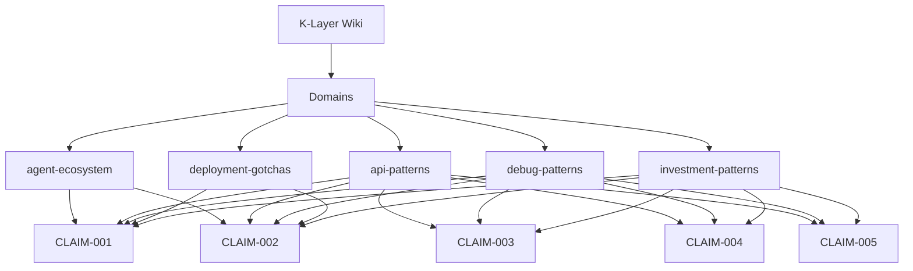

# 📊 Knowledge Graph

이 그래프는 K-Layer의 지식 구조를 시각화합니다.

```mermaid
graph TD
    K[K-Layer Wiki] --> D[Domains]
    D --> agent_ecosystem[agent-ecosystem]
    agent_ecosystem --> CLAIM_001[CLAIM-001]
    agent_ecosystem --> CLAIM_002[CLAIM-002]
    D --> api_patterns[api-patterns]
    api_patterns --> CLAIM_001[CLAIM-001]
    api_patterns --> CLAIM_002[CLAIM-002]
    api_patterns --> CLAIM_003[CLAIM-003]
    api_patterns --> CLAIM_004[CLAIM-004]
    api_patterns --> CLAIM_005[CLAIM-005]
    D --> debug_patterns[debug-patterns]
    debug_patterns --> CLAIM_001[CLAIM-001]
    debug_patterns --> CLAIM_002[CLAIM-002]
    debug_patterns --> CLAIM_003[CLAIM-003]
    debug_patterns --> CLAIM_004[CLAIM-004]
    debug_patterns --> CLAIM_005[CLAIM-005]
    D --> deployment_gotchas[deployment-gotchas]
    deployment_gotchas --> CLAIM_001[CLAIM-001]
    deployment_gotchas --> CLAIM_002[CLAIM-002]
    D --> investment_patterns[investment-patterns]
    investment_patterns --> CLAIM_001[CLAIM-001]
    investment_patterns --> CLAIM_002[CLAIM-002]
    investment_patterns --> CLAIM_003[CLAIM-003]
    investment_patterns --> CLAIM_004[CLAIM-004]
    investment_patterns --> CLAIM_005[CLAIM-005]
```

Source: wiki/graph.md#L1
